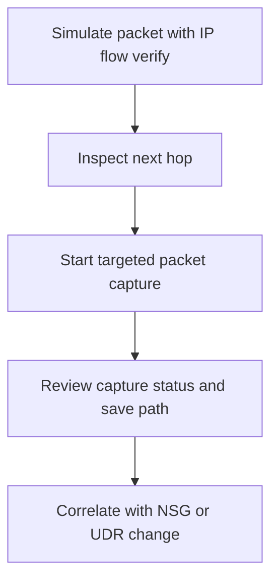

# Packet Capture and Diagnostics

Use this runbook when a reachability problem is already live and you need to prove whether NSG filtering, route selection, or the packets themselves are the actual cause.

## Prerequisites

- Azure Network Watcher enabled in the source VM region.
- Azure Network Watcher extension installed on the source VM.
- Resource IDs for the VM and NIC being diagnosed.
- Storage account or local disk target ready if captures must be preserved.

## When to Use

Use this runbook after a basic connectivity test fails and you need deeper evidence than a single pass or fail result, especially for intermittent drops, wrong next hops, or suspected rule shadowing.

<!-- diagram-id: packet-capture-and-diagnostics -->

```mermaid
flowchart TD
    A[Simulate packet with IP flow verify] --> B[Inspect next hop]
    B --> C[Start targeted packet capture]
    C --> D[Review capture status and save path]
    D --> E[Correlate with NSG or UDR change]
```

## Procedure

1. Start with packet simulation so you know whether the Azure control plane already sees an allow or deny result.
2. Check the selected next hop for the destination IP.
3. Only then start a filtered packet capture against the VM so you limit noise and storage use.
4. Save enough capture data to prove the problem, then stop the session promptly.

```bash
az network watcher test-ip-flow --resource-group $RG --location $LOCATION --direction Outbound --protocol Tcp --local 10.40.1.4:51514 --remote 10.90.0.10:443 --nic $NIC_ID
az network watcher show-next-hop --resource-group $RG --location $LOCATION --source-resource $VM_ID --dest-ip-address 10.90.0.10
az network watcher packet-capture create --resource-group $RG --name $CAPTURE_NAME --vm $VM_ID --time-limit 300 --file-path /var/captures/${CAPTURE_NAME}.cap --filters '[{"protocol":"Tcp","remotePort":"443"}]'
```
| Command | Purpose |
| --- | --- |
| `az network watcher test-ip-flow` | Simulate the packet and identify the effective NSG decision. |
| `--resource-group` | Scope diagnostics to the monitored region resources. |
| `--location` | Use the region where Network Watcher is enabled. |
| `--direction` | Specify whether the flow is inbound or outbound. |
| `--protocol` | Match the packet protocol under investigation. |
| `--local` | Provide the Azure-side IP and port. |
| `--remote` | Provide the peer IP and port. |
| `--nic` | Diagnose the exact NIC handling the traffic. |
| `az network watcher show-next-hop` | Identify the route Azure selects for the destination. |
| `--source-resource` | Point the diagnostic to the source VM resource ID. |
| `--dest-ip-address` | Test the exact destination IP. |
| `az network watcher packet-capture create` | Start a filtered packet capture session on the VM. |
| `--name` | Name the capture session. |
| `--vm` | Target the VM resource ID for capture. |
| `--time-limit` | Bound capture duration to the minimum useful window. |
| `--file-path` | Save the capture locally on the VM. |
| `--filters` | Restrict capture traffic to the relevant protocol and port. |

Expected output:

- `test-ip-flow` names the matched allow or deny rule.
- `show-next-hop` returns the chosen next-hop type and route.
- `packet-capture create` returns a running session with the configured file path.

## Verification

```bash
az network watcher packet-capture show --resource-group $RG --name $CAPTURE_NAME --location $LOCATION --output json
az network nic list-effective-nsg --resource-group $RG --name $NIC_NAME --output table
```
| Command | Purpose |
| --- | --- |
| `az network watcher packet-capture show` | Confirm the capture session status and saved file metadata. |
| `--resource-group` | Scope the capture lookup to the monitored resources. |
| `--name` | Select the capture session to inspect. |
| `--location` | Query the correct Network Watcher region. |
| `--output` | Return JSON for exact status details. |
| `az network nic list-effective-nsg` | Correlate capture findings with the effective NSG rule set. |
| `--name` | Select the same NIC used in the packet simulation. |

Healthy result:

- The capture session reaches `Running` and later `Stopped` without extension errors.
- The saved capture includes only the intended filtered traffic.
- Effective NSG output matches the rule named by `test-ip-flow`.

## Rollback / Troubleshooting

- If packet capture fails to start, confirm the Azure Network Watcher extension is present and healthy on the VM.
- If packets never appear in the capture but `test-ip-flow` allows them, investigate upstream routing or the remote endpoint.
- If `show-next-hop` points to the wrong device, stop and fix routing before taking longer captures.
- If the issue is intermittent, rerun a short filtered capture during the failure window instead of increasing capture scope blindly.

## See Also

- [Monitor Network Paths](monitor-network-paths.md)
- [Observability Best Practices](../best-practices/observability-best-practices.md)
- [Intermittent Network Failures](../troubleshooting/playbooks/connectivity/intermittent-network-failures.md)

## Sources

- [Azure Network Watcher Overview](https://learn.microsoft.com/en-us/azure/network-watcher/network-watcher-overview)
- [Packet Capture Overview](https://learn.microsoft.com/en-us/azure/network-watcher/packet-capture-overview)
