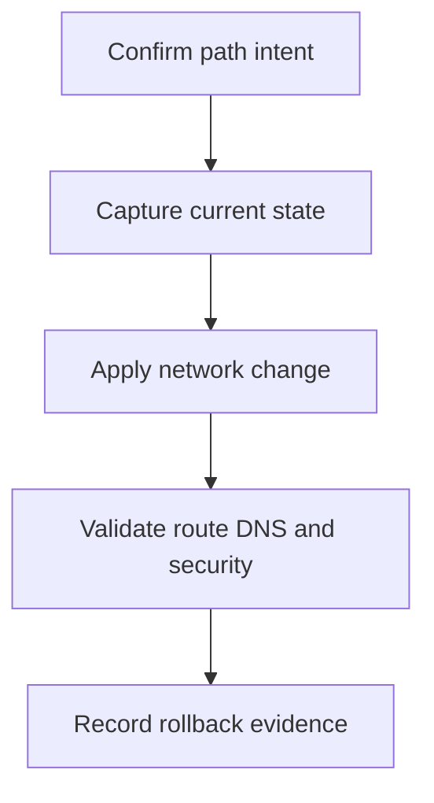

---
content_sources:
  diagrams:
  - id: operations-peering-basics-flow
    type: flowchart
    source: mslearn-adapted
    description: Runbook flow
    based_on:
    - https://learn.microsoft.com/en-us/azure/virtual-network/virtual-network-peering-overview
    - https://learn.microsoft.com/en-us/azure/virtual-network/tutorial-connect-virtual-networks-cli
content_validation:
  status: pending_review
  last_reviewed: '2026-05-22'
  reviewer: ai-agent
  core_claims:
  - claim: This document has source metadata and is queued for text-level Microsoft
      Learn verification.
    source: https://learn.microsoft.com/en-us/azure/virtual-network/virtual-network-peering-overview
    verified: false
  - claim: Core Azure networking guidance on this page should remain traceable to
      the listed sources before it is marked verified.
    source: https://learn.microsoft.com/en-us/azure/virtual-network/virtual-network-peering-overview
    verified: false
---

# Peering Basics

Create and validate VNet peering with explicit traffic-forwarding and gateway-use decisions.

## Prerequisites

- Azure CLI is installed and authenticated with permission to read and change the target networking resources.
- Required variables such as `RG`, `LOCATION`, `VNET_NAME`, and resource-specific names are set before running commands.
- The intended source, destination, protocol, port, DNS name, and rollback owner are known.
- A maintenance window is approved for production path changes.

## When to Use

A spoke VNet needs private connectivity to a hub VNet while preserving route control.

<!-- diagram-id: operations-peering-basics-flow -->


## Procedure

1. Confirm non-overlapping address spaces.
2. Create peering in both directions.
3. Enable forwarded traffic only when the hub routes through an appliance.
4. Validate effective routes and cross-VNet connectivity.

### Command sequence

```bash
az network vnet peering create \
    --resource-group $RG \
    --vnet-name $VNET_NAME \
    --name $PEERING_NAME \
    --remote-vnet $TARGET_RESOURCE_ID \
    --allow-vnet-access \
    --output json
```

| Element | Purpose |
|---|---|
| `$RG` | Resource group containing the networking resources. |
| `$VNET_NAME` | Virtual network being created, linked, or inspected. |
| `$PEERING_NAME` | Virtual network peering connection name. |
| `$TARGET_RESOURCE_ID` | Azure resource ID for the service behind the network action. |
| `--resource-group` | Scopes the command to the intended resource group. |
| `--vnet-name` | Selects the virtual network containing the subnet or peering. |
| `--name` | Identifies the target Azure networking resource. |
| `--remote-vnet` | Identifies the remote VNet in a peering. |
| `--allow-vnet-access` | Allows traffic over VNet peering. |
| `--output` | Controls output format for review or automation. |
| Expected result | Command succeeds and returns resource state, path evidence, or operation status for the change record. |

## Verification

```bash
az network vnet peering list \
    --resource-group $RG \
    --vnet-name $VNET_NAME \
    --query "[].{name:name,state:peeringState,forwarded:allowForwardedTraffic}" \
    --output table
```

| Element | Purpose |
|---|---|
| `$RG` | Resource group containing the networking resources. |
| `$VNET_NAME` | Virtual network being created, linked, or inspected. |
| `--resource-group` | Scopes the command to the intended resource group. |
| `--vnet-name` | Selects the virtual network containing the subnet or peering. |
| `--query` | Filters output to the evidence operators need. |
| `--output` | Controls output format for review or automation. |
| Expected result | Command succeeds and returns resource state, path evidence, or operation status for the change record. |

Confirm from the actual source network that DNS, route, security rule, and service response match the intended design.

## Rollback / Troubleshooting

```bash
az network vnet peering delete \
    --resource-group $RG \
    --vnet-name $VNET_NAME \
    --name $PEERING_NAME
```

| Element | Purpose |
|---|---|
| `$RG` | Resource group containing the networking resources. |
| `$VNET_NAME` | Virtual network being created, linked, or inspected. |
| `$PEERING_NAME` | Virtual network peering connection name. |
| `--resource-group` | Scopes the command to the intended resource group. |
| `--vnet-name` | Selects the virtual network containing the subnet or peering. |
| `--name` | Identifies the target Azure networking resource. |
| Expected result | Command succeeds and returns resource state, path evidence, or operation status for the change record. |

- If validation fails, stop further changes and capture current route, NSG, DNS, and Activity Log evidence.
- Roll back the smallest changed control first: rule, route, DNS link, peering flag, or private endpoint connection.
- Escalate when policy, capacity, provider circuit, or private endpoint approval state blocks the documented path.

## See Also

- [Network Design Baseline](../best-practices/network-design-baseline.md)
- [Monitor Network Paths](monitor-network-paths.md)
- [Troubleshooting Playbooks](../troubleshooting/playbooks/index.md)

## Sources

- [Virtual Network Peering Overview](https://learn.microsoft.com/en-us/azure/virtual-network/virtual-network-peering-overview)
- [Tutorial Connect Virtual Networks Cli](https://learn.microsoft.com/en-us/azure/virtual-network/tutorial-connect-virtual-networks-cli)
