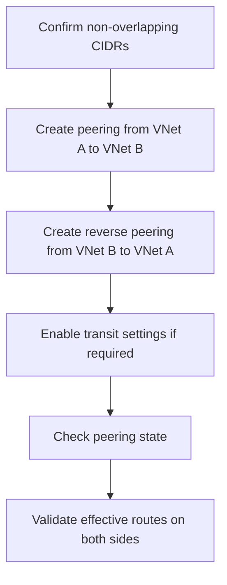

# Peering Basics

Use this runbook to connect two Azure virtual networks and prove that route exchange, gateway options, and packet reachability match the intended hub-spoke design.

## Prerequisites

- Two VNets with non-overlapping address spaces.
- Read access to both VNets, or the remote VNet resource ID if subscriptions differ.
- Clear decision on whether forwarded traffic, gateway transit, or remote gateway use should be enabled.
- Validation VMs in both VNets.

## When to Use

Use this runbook when establishing same-region or cross-region peering, enabling hub-spoke access, or validating that a peering change is responsible for a routing issue.

<!-- diagram-id: peering-basics -->


## Procedure

1. Confirm the remote VNet CIDR does not overlap with the local VNet or any already-peered ranges.
2. Create the peering from the local VNet to the remote VNet.
3. Create the return peering from the remote VNet back to the local VNet.
4. Enable forwarded traffic or gateway transit only when the architecture requires it.

```bash
az network vnet peering create --resource-group $RG_A --name ${VNET_A}-to-${VNET_B} --vnet-name $VNET_A --remote-vnet $VNET_B_ID --allow-vnet-access --allow-forwarded-traffic
az network vnet peering create --resource-group $RG_B --name ${VNET_B}-to-${VNET_A} --vnet-name $VNET_B --remote-vnet $VNET_A_ID --allow-vnet-access --allow-forwarded-traffic
az network vnet peering show --resource-group $RG_A --vnet-name $VNET_A --name ${VNET_A}-to-${VNET_B} --output json
```
| Command | Purpose |
| --- | --- |
| `az network vnet peering create` | Create a one-way peering configuration. |
| `--resource-group` | Select the resource group that owns the local VNet. |
| `--name` | Name the peering object within the local VNet. |
| `--vnet-name` | Identify the local VNet being configured. |
| `--remote-vnet` | Point the peering to the remote VNet resource ID. |
| `--allow-vnet-access` | Allow direct traffic between the two VNets. |
| `--allow-forwarded-traffic` | Permit traffic that is forwarded through a hub or NVA when required. |
| `az network vnet peering show` | Review the resulting peering state and options. |
| `--output` | Return JSON for detailed state inspection. |

Expected output:

- Both peering objects show `peeringState` as `Connected`.
- The selected traffic and transit flags match the design.
- No peering creation error reports overlapping address space.

## Verification

Check route learning from both sides and confirm a workload NIC sees the peer prefix.

```bash
az network nic show-effective-route-table --resource-group $RG_A --name $NIC_A_NAME --output table
az network nic show-effective-route-table --resource-group $RG_B --name $NIC_B_NAME --output table
```
| Command | Purpose |
| --- | --- |
| `az network nic show-effective-route-table` | Confirm the peer prefix is present as an effective route. |
| `--resource-group` | Scope the NIC lookup to each VM resource group. |
| `--name` | Select the validation NIC on each side of the peering. |
| `--output` | Render the learned routes in table form. |

Healthy result:

- Each NIC shows the opposite VNet prefix with a peering-related next hop.
- Application traffic succeeds without hairpinning through the internet.
- If gateway transit was enabled, the spoke route tables also show the advertised on-premises prefixes.

## Rollback / Troubleshooting

- If the peering remains `Initiated`, create or fix the reverse peering.
- If connectivity fails even though state is `Connected`, verify NSGs, UDRs, and any `AllowForwardedTraffic` dependency.
- If the peer prefix is missing from effective routes, confirm the VNet address spaces were saved and synced correctly.
- If spoke-to-spoke communication is expected, remember peering is not transitive; add direct peering or service chaining.

## See Also

- [How Azure Networking Works](../platform/how-azure-networking-works.md)
- [Configure UDR](configure-udr.md)
- [Peering and Routing Issues](../troubleshooting/playbooks/routing/peering-and-routing-issues.md)

## Sources

- [Azure Virtual Network Peering](https://learn.microsoft.com/en-us/azure/virtual-network/virtual-network-peering-overview)
- [Create, Change, or Delete Azure Virtual Network Peering](https://learn.microsoft.com/en-us/azure/virtual-network/virtual-network-manage-peering)
