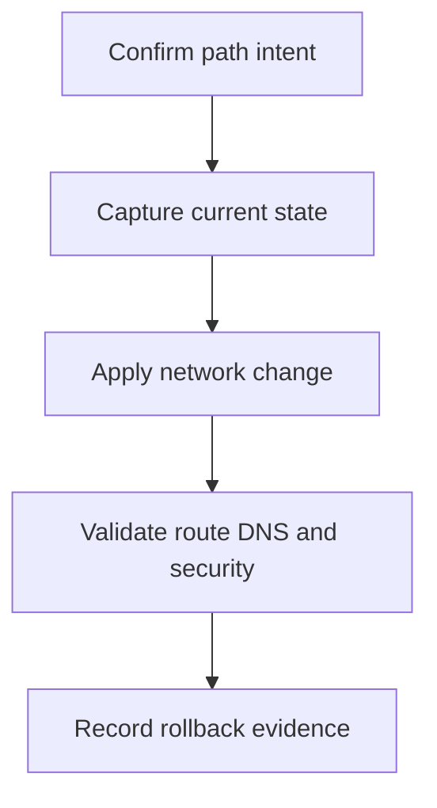

---
content_sources:
  diagrams:
  - id: operations-vpn-and-expressroute-basics-flow
    type: flowchart
    source: mslearn-adapted
    description: Runbook flow
    based_on:
    - https://learn.microsoft.com/en-us/azure/vpn-gateway/vpn-gateway-about-vpngateways
    - https://learn.microsoft.com/en-us/azure/expressroute/expressroute-introduction
content_validation:
  status: pending_review
  last_reviewed: '2026-05-22'
  reviewer: ai-agent
  core_claims:
  - claim: This document has source metadata and is queued for text-level Microsoft
      Learn verification.
    source: https://learn.microsoft.com/en-us/azure/vpn-gateway/vpn-gateway-about-vpngateways
    verified: false
  - claim: Core Azure networking guidance on this page should remain traceable to
      the listed sources before it is marked verified.
    source: https://learn.microsoft.com/en-us/azure/vpn-gateway/vpn-gateway-about-vpngateways
    verified: false
---

# VPN and ExpressRoute Basics

Operate VPN and ExpressRoute connectivity by validating gateway state, advertised routes, and failover behavior.

## Prerequisites

- Azure CLI is installed and authenticated with permission to read and change the target networking resources.
- Required variables such as `RG`, `LOCATION`, `VNET_NAME`, and resource-specific names are set before running commands.
- The intended source, destination, protocol, port, DNS name, and rollback owner are known.
- A maintenance window is approved for production path changes.

## When to Use

A hybrid network requires stable private connectivity between on-premises and Azure spokes.

<!-- diagram-id: operations-vpn-and-expressroute-basics-flow -->


## Procedure

1. Confirm gateway SKU, BGP configuration, and connected prefixes.
2. Check tunnel or circuit status before changing route propagation.
3. Validate effective routes from impacted subnets.
4. Record failover and rollback expectations for gateway changes.

### Command sequence

```bash
az network vnet-gateway show \
    --resource-group $RG \
    --name $GATEWAY_NAME \
    --query "{name:name,sku:sku.name,enableBgp:enableBgp,provisioningState:provisioningState}" \
    --output json
```

| Element | Purpose |
|---|---|
| `$RG` | Resource group containing the networking resources. |
| `$GATEWAY_NAME` | VPN or ExpressRoute virtual network gateway name. |
| `--resource-group` | Scopes the command to the intended resource group. |
| `--name` | Identifies the target Azure networking resource. |
| `--query` | Filters output to the evidence operators need. |
| `--output` | Controls output format for review or automation. |
| Expected result | Command succeeds and returns resource state, path evidence, or operation status for the change record. |

## Verification

```bash
az network vpn-connection list \
    --resource-group $RG \
    --query "[].{name:name,status:connectionStatus,egress:egressBytesTransferred,ingress:ingressBytesTransferred}" \
    --output table
```

| Element | Purpose |
|---|---|
| `$RG` | Resource group containing the networking resources. |
| `--resource-group` | Scopes the command to the intended resource group. |
| `--query` | Filters output to the evidence operators need. |
| `--output` | Controls output format for review or automation. |
| Expected result | Command succeeds and returns resource state, path evidence, or operation status for the change record. |

Confirm from the actual source network that DNS, route, security rule, and service response match the intended design.

## Rollback / Troubleshooting

- If validation fails, stop further changes and capture current route, NSG, DNS, and Activity Log evidence.
- Roll back the smallest changed control first: rule, route, DNS link, peering flag, or private endpoint connection.
- Escalate when policy, capacity, provider circuit, or private endpoint approval state blocks the documented path.

## See Also

- [Network Design Baseline](../best-practices/network-design-baseline.md)
- [Monitor Network Paths](monitor-network-paths.md)
- [Troubleshooting Playbooks](../troubleshooting/playbooks/index.md)

## Sources

- [Vpn Gateway About Vpngateways](https://learn.microsoft.com/en-us/azure/vpn-gateway/vpn-gateway-about-vpngateways)
- [Expressroute Introduction](https://learn.microsoft.com/en-us/azure/expressroute/expressroute-introduction)
