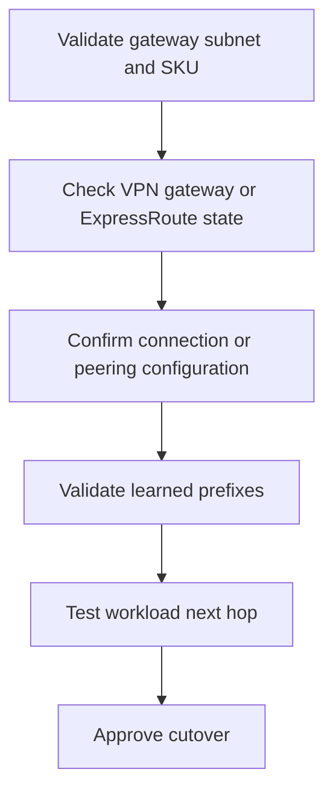

# VPN and ExpressRoute Basics

Use this runbook to validate Azure hybrid connectivity before cutover and to prove that Azure learned the intended on-premises paths through a VPN gateway or ExpressRoute circuit.

## Prerequisites

- Existing `GatewaySubnet`, virtual network gateway, and either a local network gateway or ExpressRoute circuit.
- Approved on-premises prefixes and BGP settings.
- Validation VM NIC in a workload subnet.
- Access to both Azure-side and on-premises change owners for coordinated rollback.

## When to Use

Use this runbook during site-to-site VPN activation, ExpressRoute turn-up, failover drills, or when validating that hybrid routes have propagated before application cutover.

<!-- diagram-id: vpn-and-expressroute-basics -->


## Procedure

1. Confirm the Azure gateway resource is healthy before touching the connection object.
2. For VPN, create or update the connection only after the local network gateway prefixes and shared key are confirmed.
3. For ExpressRoute, confirm that the circuit is provisioned and the Azure-side peering is enabled before relying on learned routes.
4. Validate route learning from a workload NIC instead of assuming the gateway state alone is sufficient.

```bash
az network vnet-gateway show --resource-group $RG --name $VPN_GATEWAY_NAME --output json
az network vpn-connection show --resource-group $RG --name $VPN_CONNECTION_NAME --output json
az network express-route show --resource-group $RG --name $ER_CIRCUIT_NAME --output json
az network express-route peering list --resource-group $RG --circuit-name $ER_CIRCUIT_NAME --output table
```
| Command | Purpose |
| --- | --- |
| `az network vnet-gateway show` | Inspect the Azure VPN gateway state, SKU, and IP configuration. |
| `--resource-group` | Scope the gateway lookup to the networking resource group. |
| `--name` | Select the VPN gateway resource. |
| `--output` | Return detailed JSON for health review. |
| `az network vpn-connection show` | Verify the VPN connection state and shared configuration. |
| `az network express-route show` | Inspect ExpressRoute circuit provisioning state and bandwidth. |
| `az network express-route peering list` | Review Azure private peering status and configured ASN details. |
| `--circuit-name` | Select the ExpressRoute circuit to inspect. |

Expected output:

- The VPN gateway and VPN connection show `Succeeded` or `Connected` states.
- The ExpressRoute circuit shows a provisioned service provider state and an enabled private peering.
- The JSON objects expose the expected gateway SKU, bandwidth, and peer settings.

## Verification

Confirm that Azure actually learned or selected the hybrid path from a workload subnet.

```bash
az network nic show-effective-route-table --resource-group $RG --name $NIC_NAME --output table
az network watcher show-next-hop --resource-group $RG --location $LOCATION --source-resource $VM_ID --dest-ip-address 10.90.0.10
```
| Command | Purpose |
| --- | --- |
| `az network nic show-effective-route-table` | Verify on-premises prefixes are present on the workload NIC. |
| `--resource-group` | Scope the route-table lookup to the VM resource group. |
| `--name` | Select the validation NIC. |
| `--output` | Render the learned routes as a table. |
| `az network watcher show-next-hop` | Confirm Azure chooses the hybrid gateway for an on-premises destination. |
| `--location` | Use the region where Network Watcher is enabled. |
| `--source-resource` | Identify the source VM resource ID. |
| `--dest-ip-address` | Test an on-premises destination prefix. |

Healthy result:

- Effective routes include on-premises prefixes with gateway-derived next hops.
- `show-next-hop` resolves to a virtual network gateway path for on-premises destinations.
- Application probes to the on-premises endpoint succeed after routing validation.

## Rollback / Troubleshooting

- If the gateway is healthy but the route is missing, inspect the connection object, BGP configuration, and advertised prefix list.
- If ExpressRoute is provisioned but Azure does not learn prefixes, verify the private peering BGP session with the provider team.
- If the workload subnet loses internet access after hybrid changes, inspect UDRs for unintended forced tunneling.
- If the cutover fails, fall back to the previous path decision first, then rotate shared keys or BGP policies only with the on-premises owner present.

## See Also

- [Hybrid Connectivity Basics](../platform/hybrid-connectivity-basics.md)
- [Hybrid Connectivity Best Practices](../best-practices/hybrid-connectivity-best-practices.md)
- [Hybrid Connectivity Issues](../troubleshooting/playbooks/routing/hybrid-connectivity-issues.md)

## Sources

- [About Azure VPN Gateway](https://learn.microsoft.com/en-us/azure/vpn-gateway/vpn-gateway-about-vpngateways)
- [Azure VPN Gateway configuration settings](https://learn.microsoft.com/en-us/azure/vpn-gateway/vpn-gateway-about-vpn-gateway-settings)
- [Azure ExpressRoute Overview](https://learn.microsoft.com/en-us/azure/expressroute/expressroute-introduction)
