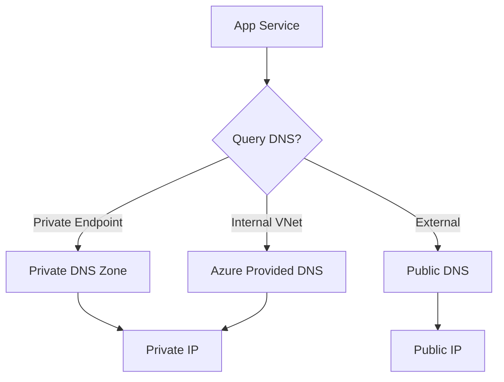

# DNS Basics

DNS provides name resolution for Azure services, both within a VNet and across hybrid environments. Proper configuration is critical for service connectivity, especially when using Private Endpoints.

| Option | Resolution Scope | Customization |
| --- | --- | --- |
| Azure-provided DNS | Internal VNet resolution. | None. |
| Custom DNS | External or on-prem servers. | Full control. |
| Private DNS Zones | Managed resolution for VNets. | High control. |
| Azure DNS Private Resolver| Hybrid DNS queries. | Managed service. |

!!! warning
    Private Endpoint (PE) deployments without a properly linked Private DNS Zone are the most common source of networking issues. Clients will resolve the public IP but fail to connect privately.

## See Also

- [DNS Best Practices](../best-practices/dns-best-practices.md)
- [Configure DNS](../operations/configure-dns.md)
- [DNS Resolution Failures](../troubleshooting/dns-resolution-failures.md)

## Sources

- [What is Azure DNS?](https://learn.microsoft.com/en-us/azure/dns/dns-overview)
- [Azure Private Endpoint DNS configuration](https://learn.microsoft.com/en-us/azure/private-link/private-endpoint-dns)
