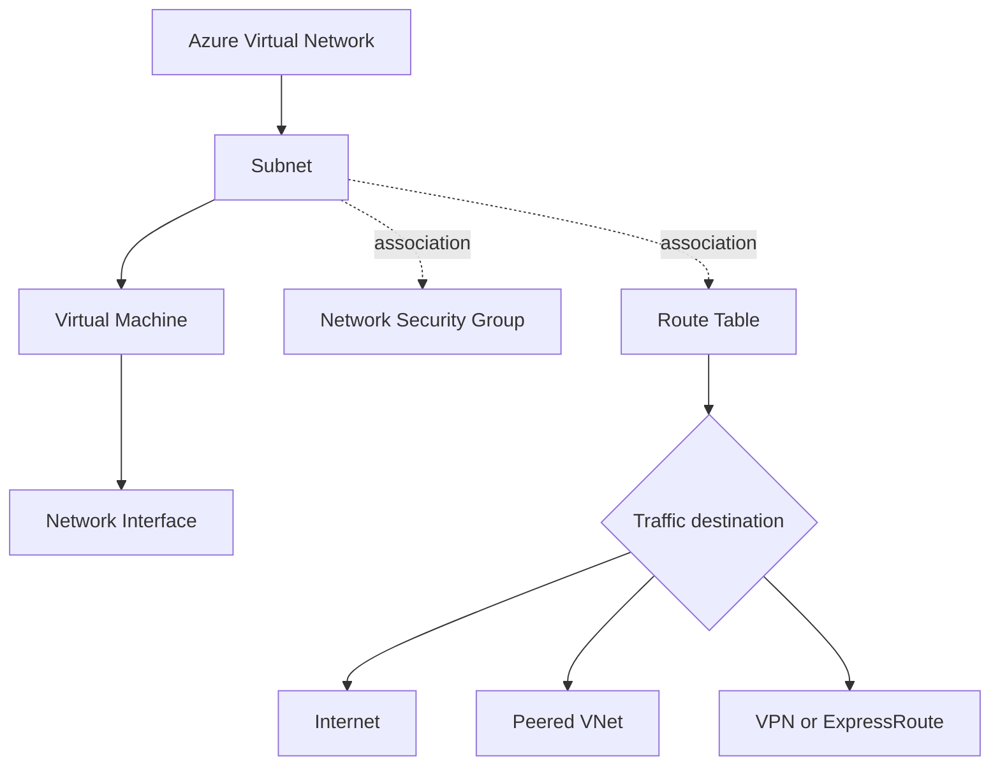

---
hide:
  - toc
content_sources:
  diagrams:
    - id: how-azure-networking-works
      type: flowchart
      source: mslearn-adapted
      mslearn_url: https://learn.microsoft.com/en-us/azure/security/fundamentals/network-best-practices
      based_on:
        - https://learn.microsoft.com/en-us/azure/cloud-adoption-framework/ready/landing-zone/design-area/network-topology-and-connectivity
---

# How Azure Networking Works

Azure Networking provides the infrastructure to connect cloud services and on-premises environments. It's built on a global fiber-optic network that uses Software Defined Networking (SDN) to manage traffic flows.

| Component | Responsibility | Managed By |
| --- | --- | --- |
| Physical Network | Fiber, routers, switches | Microsoft |
| VNet | Address space, logical isolation | User |
| Subnet | Micro-segmentation | User |
| Network Interface (NIC) | Virtual hardware connection | User |
| NSG Rules | Access control lists | User |
| Route Table | Custom traffic steering | User |

<!-- diagram-id: how-azure-networking-works -->

!!! note
    Azure uses a massive global backbone network. Traffic between Azure regions stays on this backbone and does not traverse the public internet unless explicitly configured.

## See Also

- [VNet and Subnet Basics](vnet-and-subnet-basics.md)
- [Routing Basics](routing-basics.md)
- [Network Security Basics](network-security-basics.md)

## Sources

- [Azure network security fundamentals](https://learn.microsoft.com/en-us/azure/security/fundamentals/network-best-practices)
- [VNet architecture and design](https://learn.microsoft.com/en-us/azure/cloud-adoption-framework/ready/landing-zone/design-area/network-topology-and-connectivity)
