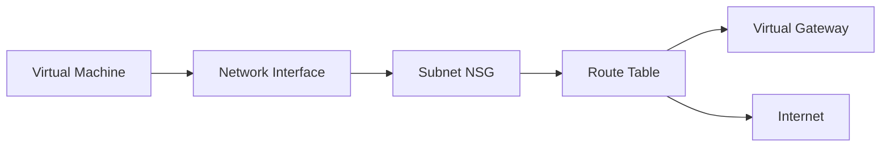

# How Azure Networking Works

Azure Networking provides the infrastructure to connect cloud services and on-premises environments. It's built on a global fiber-optic network that uses Software Defined Networking (SDN) to manage traffic flows.

| Component | Responsibility | Managed By |
| --- | --- | --- |
| Physical Network | Fiber, routers, switches | Microsoft |
| VNet | Address space, logical isolation | User |
| Subnet | Micro-segmentation | User |
| Network Interface (NIC) | Virtual hardware connection | User |
| NSG Rules | Access control lists | User |
| Route Table | Custom traffic steering | User |

!!! note
    Azure uses a massive global backbone network. Traffic between Azure regions stays on this backbone and does not traverse the public internet unless explicitly configured.

## Sources

- [Azure network security fundamentals](https://learn.microsoft.com/en-us/azure/security/fundamentals/network-best-practices)
- [VNet architecture and design](https://learn.microsoft.com/en-us/azure/cloud-adoption-framework/ready/azure-best-practices/virtual-network-device-configuration-and-requirements)
