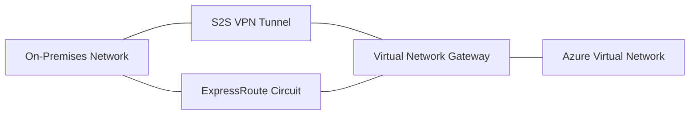

# Hybrid Connectivity Basics

Hybrid connectivity allows you to extend your on-premises network into Azure, enabling seamless communication between local resources and cloud services.

| Feature | VPN Gateway | ExpressRoute |
| --- | --- | --- |
| Bandwidth | Up to 10 Gbps. | Up to 100 Gbps. |
| Latency | Variable (Internet). | Low/Predictable (Private). |
| Cost | Lower cost. | Higher (Circuit + Port). |
| Best Use Case | Branch offices, Dev/Test. | Critical workloads, Data migrations. |

!!! note
    Hybrid DNS is often the most complex part of a hybrid setup. Consider using Azure DNS Private Resolvers to bridge queries between on-premises and Azure Private DNS Zones.

## Sources

- [About VPN Gateway](https://learn.microsoft.com/en-us/azure/vpn-gateway/vpn-gateway-about-vpngateways)
- [ExpressRoute overview](https://learn.microsoft.com/en-us/azure/expressroute/expressroute-introduction)
