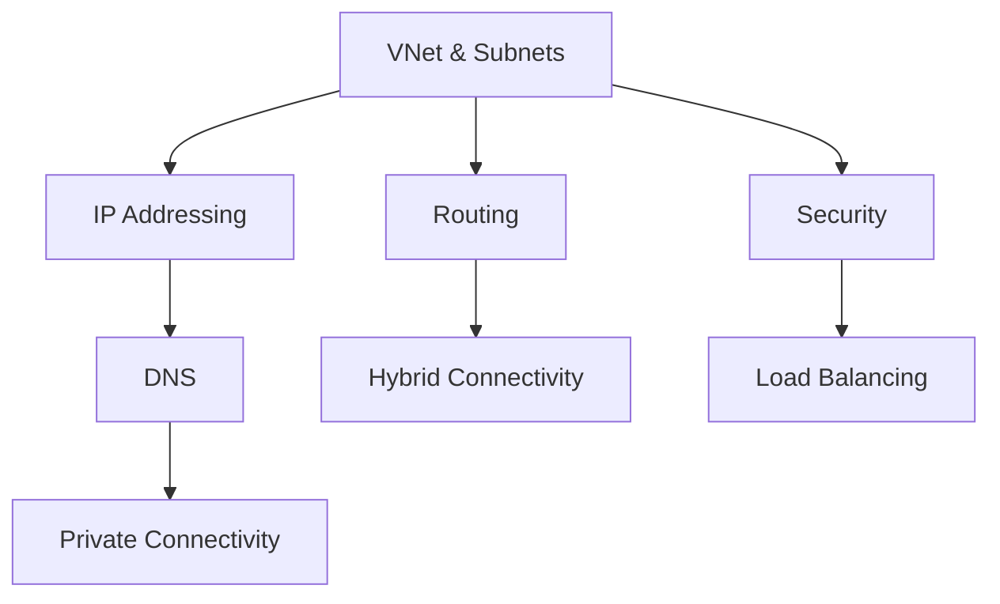

# Platform Fundamentals

This section provides a deep dive into the core components of Azure networking. Understanding these fundamentals is necessary for designing secure, scalable, and resilient cloud architectures.

| Topic | Description |
| --- | --- |
| How Azure Networking Works | High-level overview of region, VNet, and packet paths. |
| VNet and Subnet Basics | Core building blocks for network isolation and IP design. |
| IP Addressing | Management of public and private IP resources. |
| DNS Basics | Resolution mechanisms for cloud and hybrid environments. |
| Routing Basics | Traffic steering using system and user-defined routes. |
| Network Security Basics | Protective layers including NSGs and Firewalls. |
| Load Balancing Options | Distributing traffic across compute resources. |
| Private Connectivity Options | Secure access to Azure PaaS via Private Link. |
| Hybrid Connectivity Basics | Connecting on-premises sites to Azure VNets. |

## Sources

- [Azure Virtual Network concepts](https://learn.microsoft.com/en-us/azure/virtual-network/virtual-networks-overview)
- [Azure networking services overview](https://learn.microsoft.com/en-us/azure/networking/fundamentals/networking-overview)
