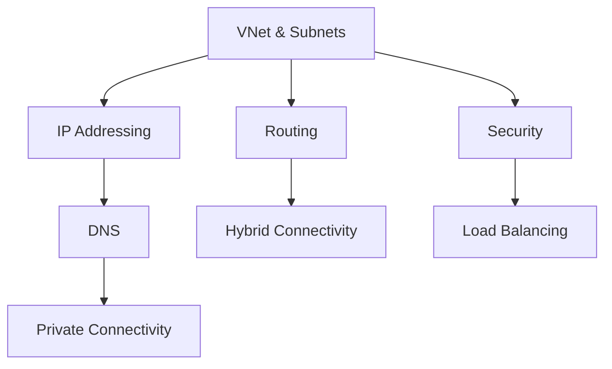

---
hide:
  - toc
---

# Platform Fundamentals

This section provides a deep dive into the core components of Azure networking. Understanding these fundamentals is necessary for designing secure, scalable, and resilient cloud architectures.

| Topic | Description |
| --- | --- |
| [How Azure Networking Works](how-azure-networking-works.md) | High-level overview of region, VNet, and packet paths. |
| [VNet and Subnet Basics](vnet-and-subnet-basics.md) | Core building blocks for network isolation and IP design. |
| [IP Addressing](ip-addressing.md) | Management of public and private IP resources. |
| [DNS Basics](dns-basics.md) | Resolution mechanisms for cloud and hybrid environments. |
| [Routing Basics](routing-basics.md) | Traffic steering using system and user-defined routes. |
| [Network Security Basics](network-security-basics.md) | Protective layers including NSGs and Firewalls. |
| [Load Balancing Options](load-balancing-options.md) | Distributing traffic across compute resources. |
| [Private Connectivity Options](private-connectivity-options.md) | Secure access to Azure PaaS via Private Link. |
| [Hybrid Connectivity Basics](hybrid-connectivity-basics.md) | Connecting on-premises sites to Azure VNets. |

!!! tip
    Start with VNet and subnet design first, then validate routing, security, and DNS in that order before selecting connectivity patterns.

## See Also

- [Start Here Overview](../start-here/overview.md)
- [How Azure Networking Works](how-azure-networking-works.md)
- [VNet and Subnet Basics](vnet-and-subnet-basics.md)

## Sources

- [Azure Virtual Network concepts](https://learn.microsoft.com/en-us/azure/virtual-network/virtual-networks-overview)
- [Azure networking services overview](https://learn.microsoft.com/en-us/azure/networking/fundamentals/networking-overview)
