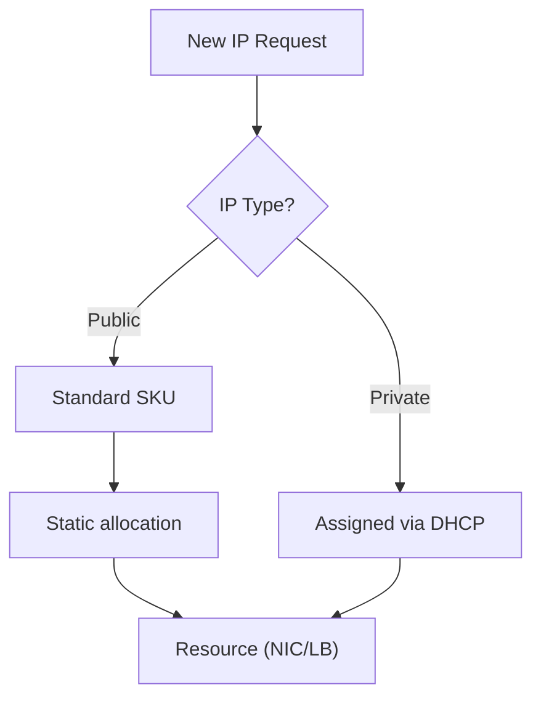

---
hide:
  - toc
---

# IP Addressing

Azure uses a flexible IP addressing scheme for both private and public communications. Public IPs enable external access, while private IPs handle internal resource connectivity.

| IP Type | Allocation | Lifecycle | Use Case |
| --- | --- | --- | --- |
| Private Dynamic | DHCP from subnet. | May change after stop/deallocate; released only when NIC deleted. | General compute. |
| Private Static | User-defined from subnet. | Persists until deleted. | Domain controllers, DNS servers. |
| Public Dynamic | Assigned from Azure pool. | Changes if deallocated/reassigned. | Legacy scenarios only. |
| Public Static | Fixed from Azure pool. | Persists across restarts. | VPN gateways, Firewalls. |

!!! note
    Basic SKU public IPs were retired on 30 Sep 2025. Use Standard SKU for all deployments.
    Dynamic public IP behavior is tied to deallocation/reassignment events, not a simple reboot.

## See Also

- [VNet and Subnet Basics](vnet-and-subnet-basics.md)
- [DNS Basics](dns-basics.md)
- [Azure Networking Components](../reference/azure-networking-components.md)

## Sources

- [Public IP address types and methods](https://learn.microsoft.com/en-us/azure/virtual-network/ip-services/public-ip-addresses)
- [Private IP addresses in Azure](https://learn.microsoft.com/en-us/azure/virtual-network/ip-services/private-ip-addresses)
