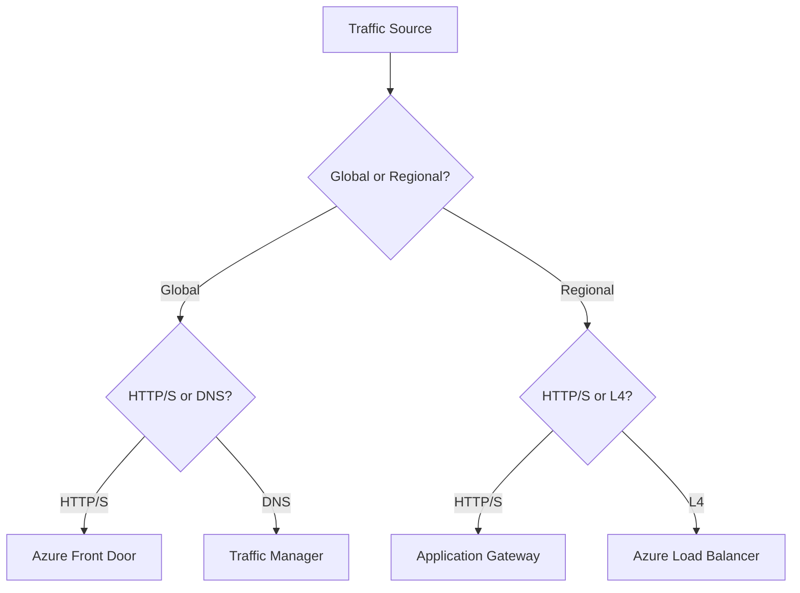

# Load Balancing Options

Azure offers several services to distribute traffic across your applications. Choosing the right one depends on the layer of the OSI model you need to operate at and the scope of your application.

| Service | OSI Layer | Scope | Key Feature |
| --- | --- | --- | --- |
| Azure Load Balancer | Layer 4 | Regional | High throughput, low latency. |
| Application Gateway | Layer 7 | Regional | URL-based routing, WAF. |
| Azure Front Door | Layer 7 | Global | CDN, WAF, SSL offload. |
| Traffic Manager | DNS | Global | Performance, Priority routing. |

## Sources

- [Load-balancing options in Azure](https://learn.microsoft.com/en-us/azure/architecture/guide/technology-choices/load-balancing-overview)
- [Decision tree for load balancing in Azure](https://learn.microsoft.com/en-us/azure/architecture/guide/technology-choices/load-balancing-decision-tree)
