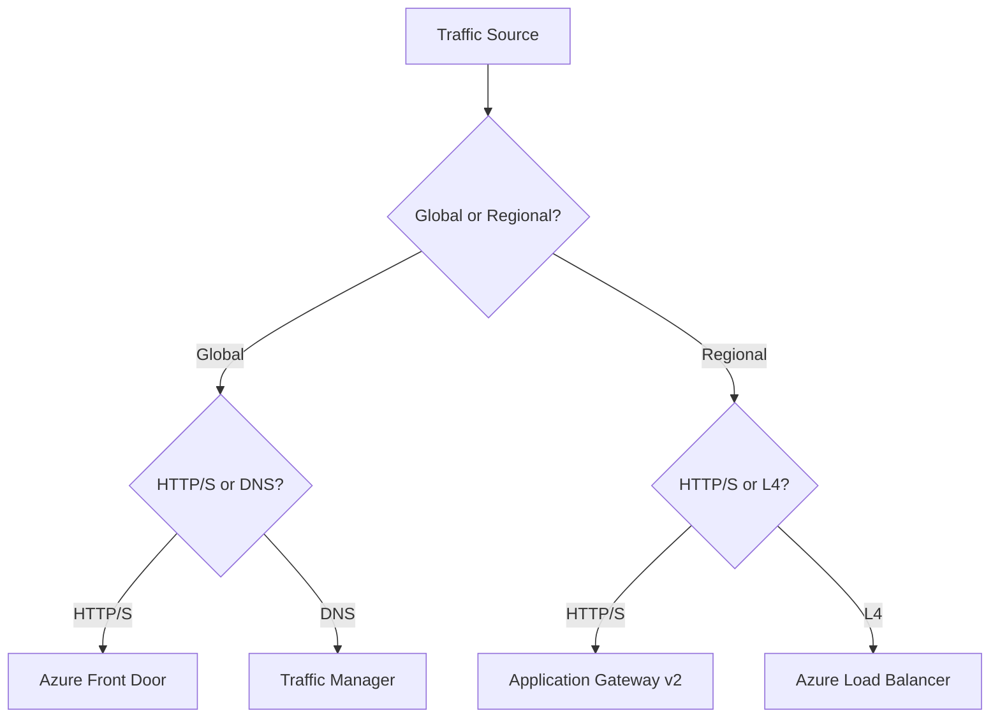

---
hide:
  - toc
content_sources:
  diagrams:
    - id: load-balancing-options
      type: flowchart
      source: mslearn-adapted
      mslearn_url: https://learn.microsoft.com/en-us/azure/architecture/guide/technology-choices/load-balancing-overview
      based_on:
        - https://learn.microsoft.com/en-us/azure/architecture/guide/technology-choices/load-balancing-overview#choose-a-load-balancing-solution-for-your-scenario
---

# Load Balancing Options

Azure offers several services to distribute traffic across your applications. Choosing the right one depends on the layer of the OSI model you need to operate at and the scope of your application.

| Service | OSI Layer | Scope | Key Feature |
| --- | --- | --- | --- |
| Azure Load Balancer | Layer 4 | Regional | High throughput, low latency. |
| Application Gateway v2 (recommended) | Layer 7 | Regional | URL-based routing, WAF, autoscaling, zone redundancy, static VIPs. |
| Azure Front Door | Layer 7 | Global | CDN, WAF, SSL offload. |
| Traffic Manager | DNS | Global | Performance, Priority routing. |

<!-- diagram-id: load-balancing-options -->

!!! tip
    Start with traffic scope (global or regional), then choose by protocol layer (L7 HTTP/S or L4 TCP/UDP) to narrow the correct load-balancing service quickly.

!!! warning
    Application Gateway v1 retires on April 28, 2026. Prefer v2 for autoscaling, zone redundancy, and static VIP support.

## See Also

- [How Azure Networking Works](how-azure-networking-works.md)
- [Connectivity Decision Guide](../reference/connectivity-decision-guide.md)
- [Private Connectivity Options](private-connectivity-options.md)

## Sources

- [Load-balancing options in Azure](https://learn.microsoft.com/en-us/azure/architecture/guide/technology-choices/load-balancing-overview)
- [Decision tree for load balancing in Azure](https://learn.microsoft.com/en-us/azure/architecture/guide/technology-choices/load-balancing-overview#choose-a-load-balancing-solution-for-your-scenario)
