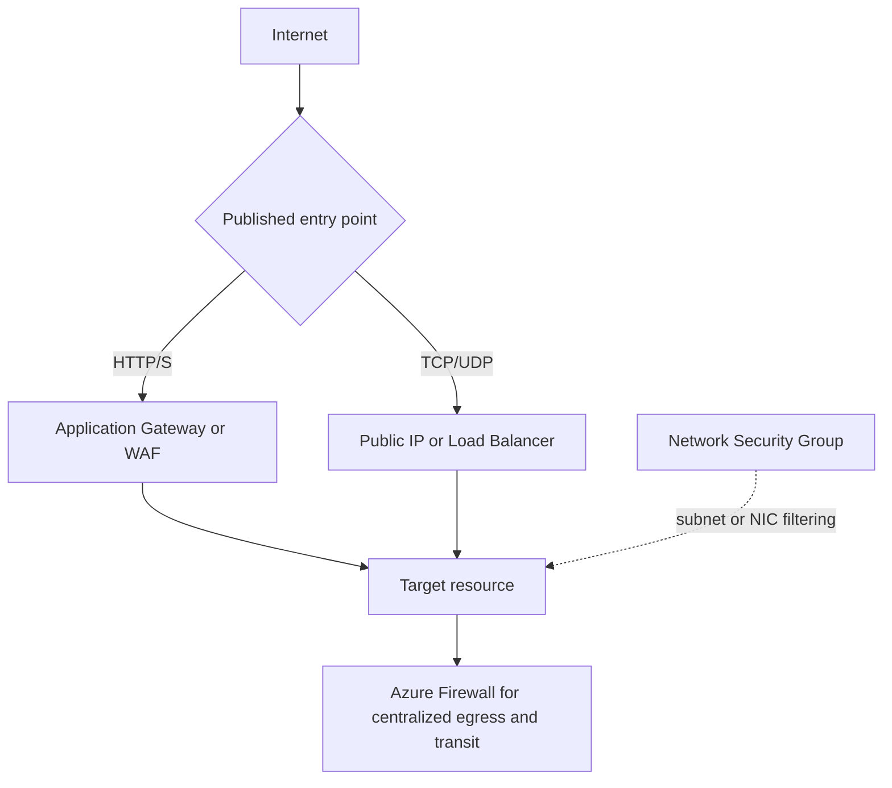

---
hide:
  - toc
content_sources:
  diagrams:
    - id: network-security-basics
      type: flowchart
      source: mslearn-adapted
      mslearn_url: https://learn.microsoft.com/en-us/azure/networking/fundamentals/networking-overview#network-security
      based_on:
        - https://learn.microsoft.com/en-us/azure/virtual-network/network-security-groups-overview
---

# Network Security Basics

Azure network security is based on a zero-trust model, implementing multiple layers of defense to protect resources from unauthorized access.

| Control | Layer | Scope | Key Feature |
| --- | --- | --- | --- |
| NSG | Layer 3/4 | Subnet/NIC | Stateful filtering. |
| Azure Firewall | Layer 3/4/7 | Regional | FQDN filtering. |
| WAF | Layer 7 | Global/Regional | OWASP protection. |
| DDoS Protection | Layer 3/4 | VNet / Public IP | Mitigates attacks for protected resources. |

<!-- diagram-id: network-security-basics -->

!!! note
    NSG rules are processed in priority order (lowest number first). Once a match is found, no further rules are processed. Default rules are always at the end with the highest numbers.

## Security Control Placement

| Placement | Primary Control | Typical Outcome |
| --- | --- | --- |
| Edge ingress | DDoS + WAF | Reduced attack surface |
| Network transit | Azure Firewall | Centralized policy enforcement |
| Workload subnet | NSG | Least-privilege east-west filtering |

## See Also

- [NSG and Firewall Best Practices](../best-practices/nsg-and-firewall-best-practices.md)
- [Configure Network Security Groups](../operations/configure-nsg.md)
- [NSG vs UDR vs Firewall](../troubleshooting/playbooks/routing/nsg-vs-udr-vs-firewall.md)

## Sources

- [Azure network security overview](https://learn.microsoft.com/en-us/azure/networking/fundamentals/networking-overview#network-security)
- [Network security groups overview](https://learn.microsoft.com/en-us/azure/virtual-network/network-security-groups-overview)
