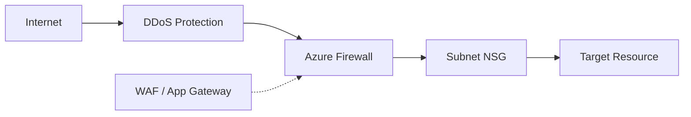

# Network Security Basics

Azure network security is based on a zero-trust model, implementing multiple layers of defense to protect resources from unauthorized access.

| Control | Layer | Scope | Key Feature |
| --- | --- | --- | --- |
| NSG | Layer 4 | Subnet/NIC | Statefull filtering. |
| Azure Firewall | Layer 3/4/7 | Regional | FQDN filtering. |
| WAF | Layer 7 | Global/Regional | OWASP protection. |
| DDoS Protection | Layer 3/4 | Global | Traffic scrubbing. |

!!! note
    NSG rules are processed in priority order (lowest number first). Once a match is found, no further rules are processed. Default rules are always at the end with the highest numbers.

## Sources

- [Azure network security overview](https://learn.microsoft.com/en-us/azure/networking/fundamentals/networking-overview#network-security)
- [Network security groups overview](https://learn.microsoft.com/en-us/azure/virtual-network/network-security-groups-overview)
