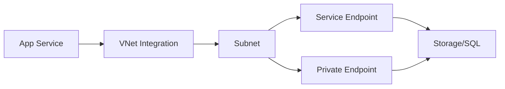

# Private Connectivity Options

Azure provides several ways to connect to PaaS services privately, without exposing traffic to the public internet. Understanding the nuances between these options is key to a secure network design.

| Option | DNS Impact | Scope | Security Model |
| --- | --- | --- | --- |
| Service Endpoint | No DNS change. | Subnet-specific. | ACL-based. |
| Private Endpoint | Changes resolution. | NIC-level. | Private IP-based. |
| VNet Integration | Outbound only. | Regional. | Subnet-delegated. |

!!! warning
    Service Endpoints do NOT change DNS. Traffic is routed privately, but the client still resolves the public IP of the service. Private Endpoints change DNS resolution to the private IP assigned to the endpoint.

## Sources

- [What is Azure Private Link?](https://learn.microsoft.com/en-us/azure/private-link/private-link-overview)
- [Virtual Network service endpoints](https://learn.microsoft.com/en-us/azure/virtual-network/virtual-network-service-endpoints-overview)
