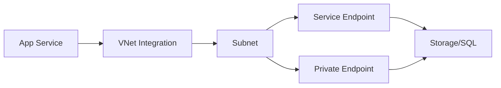

---
hide:
  - toc
content_sources:
  diagrams:
    - id: private-connectivity-options
      type: flowchart
      source: mslearn-adapted
      mslearn_url: https://learn.microsoft.com/en-us/azure/private-link/private-link-overview
      based_on:
        - https://learn.microsoft.com/en-us/azure/virtual-network/virtual-network-service-endpoints-overview
---

# Private Connectivity Options

Azure provides several ways to connect to PaaS services privately, without exposing traffic to the public internet. Understanding the nuances between these options is key to a secure network design.

| Option | DNS Impact | Scope | Security Model |
| --- | --- | --- | --- |
| Service Endpoint | No DNS change. | Subnet-specific. | ACL-based. |
| Private Endpoint | Changes resolution. | NIC-level. | Private IP-based. |
| VNet Integration | Outbound only. | Regional. | Subnet-delegated. |

<!-- diagram-id: private-connectivity-options -->

!!! warning
    Service Endpoints do NOT change DNS. Traffic is routed privately, but the client still resolves the public IP of the service. Private Endpoints change DNS resolution to the private IP assigned to the endpoint.

## Selection Checklist

| Requirement | Prefer | Rationale |
| --- | --- | --- |
| Strict private IP dependency | Private Endpoint | Private address target on client side |
| Minimal DNS changes | Service Endpoint | Route policy without name changes |
| App Service outbound private access | VNet Integration | Private egress path from app runtime |

## See Also

- [Private Endpoint Best Practices](../best-practices/private-endpoint-best-practices.md)
- [Connect Private Endpoints](../operations/connect-private-endpoints.md)
- [Private Connectivity Options Reference](../reference/private-connectivity-options.md)

## Sources

- [What is Azure Private Link?](https://learn.microsoft.com/en-us/azure/private-link/private-link-overview)
- [Virtual Network service endpoints](https://learn.microsoft.com/en-us/azure/virtual-network/virtual-network-service-endpoints-overview)
