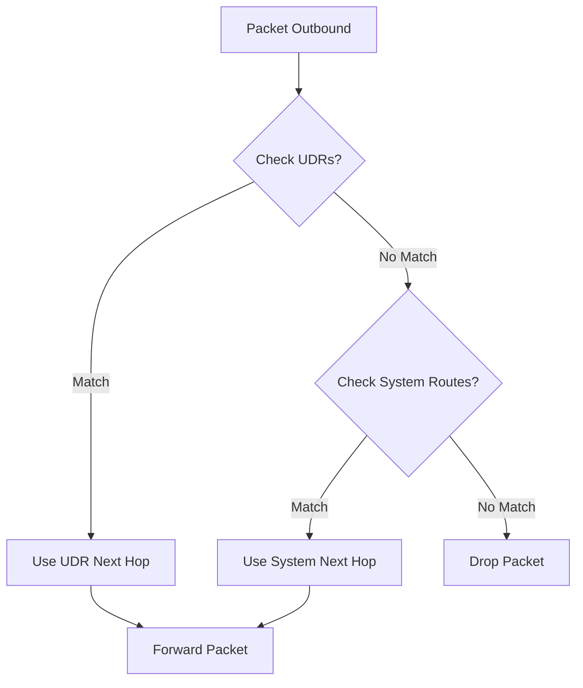

# Routing Basics

Azure automatically creates system routes for each subnet in a VNet. User-Defined Routes (UDR) allow you to override these default system routes to steer traffic through virtual appliances or gateways.

| Next Hop Type | Description | Common Use Case |
| --- | --- | --- |
| Virtual Network | Traffic stays within the VNet. | Standard VNet communication. |
| Internet | Traffic routed to the public internet. | Default outbound access. |
| Virtual Appliance | Traffic sent to a VM or Firewall. | Centralized inspection. |
| VNet Gateway | Traffic sent to VPN/ExpressRoute. | Hybrid connectivity. |
| None | Traffic is dropped. | Black-holing unwanted traffic. |

!!! note
    Use the "Effective Routes" tool in the Azure portal for any network interface to troubleshoot why traffic is taking a specific path.

## Sources

- [Azure virtual network traffic routing](https://learn.microsoft.com/en-us/azure/virtual-network/virtual-networks-udr-overview)
- [Tutorial: Route network traffic with a route table](https://learn.microsoft.com/en-us/azure/virtual-network/tutorial-create-route-table-portal)
