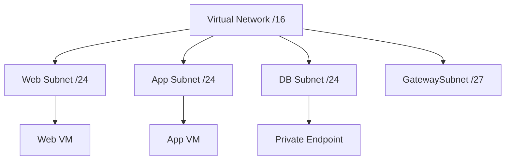

# VNet and Subnet Basics

Virtual Networks (VNets) are the fundamental building block for your private network in Azure. They provide isolation, segmentation, and communication for your cloud resources.

| Property | Description | Scope |
| --- | --- | --- |
| Address Space | CIDR block defining the network range. | VNet |
| Region | Location where the VNet resides. | Regional |
| Peering | Connects two VNets via Azure backbone. | Global/Regional |
| DNS Settings | Specifies Azure or custom DNS servers. | VNet |

| Subnet Type | Common Purpose | Mandatory Name |
| --- | --- | --- |
| Default | General workload hosting (VMs, etc). | N/A |
| Gateway | Site-to-Site VPN or ExpressRoute. | GatewaySubnet |
| Bastion | Secure RDP/SSH management access. | AzureBastionSubnet |
| Firewall | Centralized network security. | AzureFirewallSubnet |
| Private Endpoint | Private access to PaaS services. | N/A |

## Sources

- [Azure Virtual Network concepts](https://learn.microsoft.com/en-us/azure/virtual-network/virtual-networks-overview)
- [Plan and design Azure Virtual Networks](https://learn.microsoft.com/en-us/azure/virtual-network/virtual-network-vnet-plan-design-arm)
