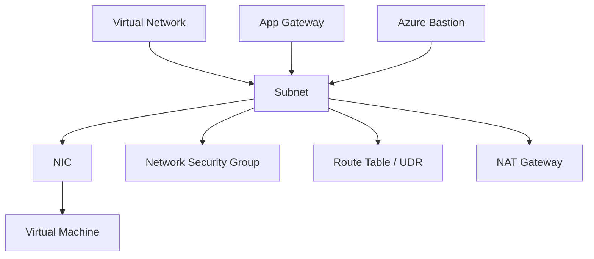

# Azure Networking Components

Comprehensive breakdown of core Azure networking resources and their primary functions.

| Component | Category | Layer | Purpose | Key Limit / Default |
| :--- | :--- | :--- | :--- | :--- |
| VNet | Foundation | 3 | Private IP address space | 1000 per subscription |
| Subnet | Foundation | 3 | Segmentation of VNet | 5 reserved IPs per subnet |
| NIC | Connectivity | 2 | Connects VM to VNet | Max NICs depend on VM size |
| NSG | Security | 3/4 | Filter traffic (IP/Port) | 1000 rules per NSG |
| UDR | Routing | 3 | Overwrite default routes | 400 routes per table |
| Public IP | Connectivity | 3 | Internet accessibility | Static or Dynamic |
| Private Endpoint | Connectivity | 3 | Private access to PaaS | Uses IP from subnet |
| Service Endpoint | Connectivity | 3 | Secure PaaS to VNet | No private IP assigned |
| NAT Gateway | Connectivity | 4 | Outbound SNAT | 64k concurrent flows/IP |
| Load Balancer | Delivery | 4 | Hash-based distribution | L4 only (TCP/UDP) |
| App Gateway | Delivery | 7 | Web traffic management | WAF support |
| Front Door | Delivery | 7 | Global CDN / App accel | Global service |
| Azure Firewall | Security | 3-7 | Managed cloud firewall | High availability built-in |
| Azure Bastion | Security | 7 | RDP/SSH via browser | No public IP on VM |
| VPN Gateway | Hybrid | 3 | Encrypted site-to-site | Max 10 Gbps |
| ExpressRoute | Hybrid | 3 | Private dedicated link | Up to 100 Gbps |
| Private DNS | Resolution | 7 | VNet name resolution | Link to multiple VNets |
| Network Watcher | Monitoring | - | Diagnostic tools | Regional service |

!!! warning
    Component limits vary by SKU, region, and subscription quotas; validate current limits before production rollout.

## See Also

- [How Azure Networking Works](../platform/how-azure-networking-works.md)
- [VNet and Subnet Basics](../platform/vnet-and-subnet-basics.md)
- [Glossary](./glossary.md)

## Sources

- [Azure Virtual Network concepts](https://learn.microsoft.com/en-us/azure/virtual-network/virtual-networks-overview)
- [Azure subscription limits and quotas](https://learn.microsoft.com/en-us/azure/azure-resource-manager/management/azure-subscription-service-limits)
- [Azure Networking architecture](https://learn.microsoft.com/en-us/azure/architecture/guide/networking/networking-start-here)
