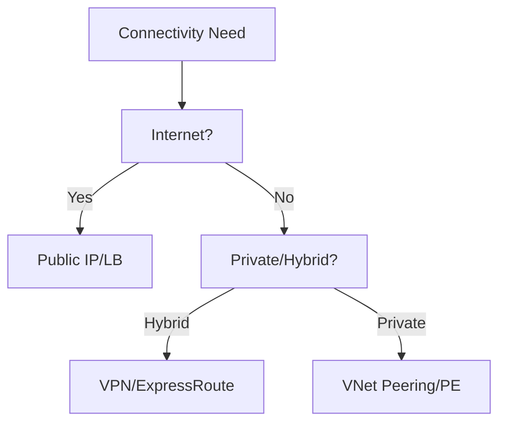

# Connectivity Decision Guide

Recommended connectivity approaches based on scenario requirements.

| Scenario | Recommended Approach | Key Benefit |
| :--- | :--- | :--- |
| Internet-facing | Public IP / Load Balancer | Direct external access. |
| Private-only | Private Endpoint / VNet Peering | No internet exposure. |
| Hybrid | VPN / ExpressRoute | Secure on-premises connection. |
| Multi-region | Global VNet Peering | Low latency backbone. |
| SaaS Access | Private Link | Private access to PaaS/SaaS. |

!!! note
    Hybrid connectivity choice depends on bandwidth and reliability needs. VPN uses internet tunnels, while ExpressRoute provides a dedicated circuit.

## Sources

- [Azure Architecture Center: Choose a hybrid networking solution](https://learn.microsoft.com/en-us/azure/architecture/guide/networking/hybrid-networking)
- [Azure Virtual Network concepts](https://learn.microsoft.com/en-us/azure/virtual-network/virtual-networks-overview)
- [Azure Private Link documentation](https://learn.microsoft.com/en-us/azure/private-link/)
