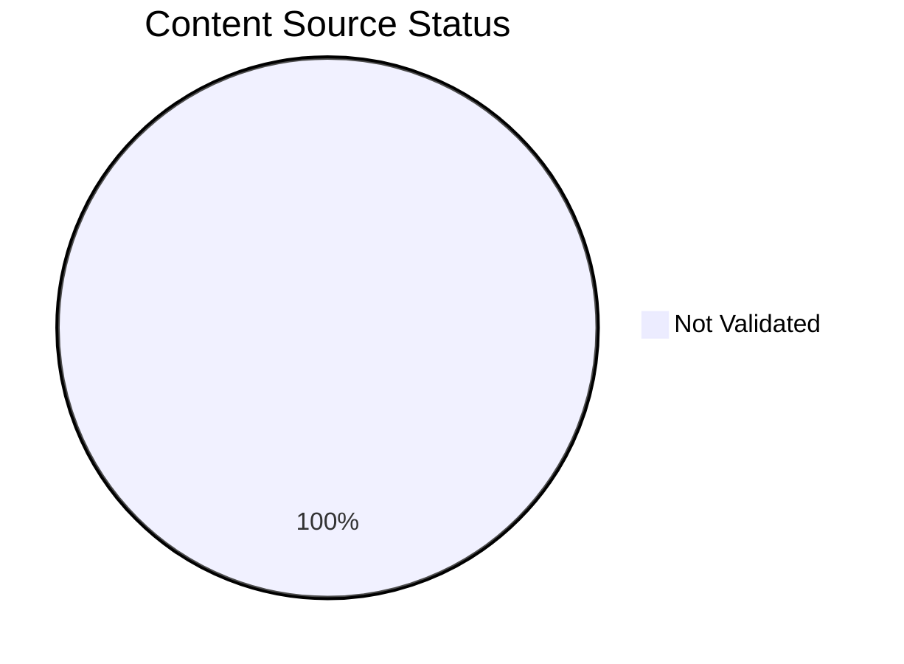
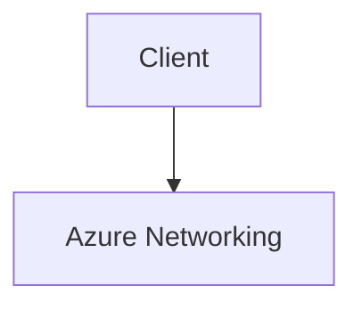

# Content Source Validation Status

This page tracks the source validation status of all documentation content, including diagrams and text content. All content must be traceable to official Microsoft Learn documentation.

## Summary

*Generated: 2026-04-10*

| Content Type | Total | MSLearn Sourced | Self-Generated | No Source |
|---|---:|---:|---:|---:|
| Mermaid Diagrams | 80 | 0 | 0 | 80 |
| Text Sections | — | — | — | — |

!!! warning "Validation Required"
    All 80 mermaid diagrams require source validation. Content without Microsoft Learn sources must be either:
    
    1. Linked to an official Microsoft Learn URL, or
    2. Marked as `self-generated` with clear justification



## Validation Categories

### Source Types

| Type | Description | Allowed |
|---|---|---|
| `mslearn` | Content directly from or based on Microsoft Learn | Yes |
| `mslearn-adapted` | Microsoft Learn content adapted for this guide | Yes, with source URL |
| `self-generated` | Original content created for this guide | Requires justification |
| `community` | From community sources | Not for core content |
| `unknown` | Source not documented | Must be validated |

### Diagram Validation Status

#### Platform Diagrams

| File | Diagrams | Source Type | Microsoft Learn URL | Status |
|---|---:|---|---|---|
| [how-azure-networking-works.md](../platform/how-azure-networking-works.md) | 10 | unknown | — | Not Validated |
| [vnet-and-subnet-basics.md](../platform/vnet-and-subnet-basics.md) | 8 | unknown | — | Not Validated |
| [ip-addressing.md](../platform/ip-addressing.md) | 8 | unknown | — | Not Validated |
| [dns-basics.md](../platform/dns-basics.md) | 8 | unknown | — | Not Validated |
| [routing-basics.md](../platform/routing-basics.md) | 8 | unknown | — | Not Validated |
| [network-security-basics.md](../platform/network-security-basics.md) | 8 | unknown | — | Not Validated |
| [load-balancing-options.md](../platform/load-balancing-options.md) | 10 | unknown | — | Not Validated |
| [private-connectivity-options.md](../platform/private-connectivity-options.md) | 10 | unknown | — | Not Validated |
| [hybrid-connectivity-basics.md](../platform/hybrid-connectivity-basics.md) | 10 | unknown | — | Not Validated |

#### Troubleshooting and Reference Diagrams

| File | Diagrams | Source Type | Microsoft Learn URL | Status |
|---|---:|---|---|---|
| [decision-tree.md](../troubleshooting/decision-tree.md) | 2 | unknown | — | Not Validated |
| [evidence-map.md](../troubleshooting/evidence-map.md) | 2 | unknown | — | Not Validated |
| [mental-model.md](../troubleshooting/mental-model.md) | 2 | unknown | — | Not Validated |
| [quick-diagnosis-cards.md](../troubleshooting/quick-diagnosis-cards.md) | 2 | unknown | — | Not Validated |
| [connectivity-decision-guide.md](connectivity-decision-guide.md) | 3 | unknown | — | Not Validated |
| [azure-networking-components.md](azure-networking-components.md) | 4 | unknown | — | Not Validated |
| [dns-resolution-cheatsheet.md](dns-resolution-cheatsheet.md) | 3 | unknown | — | Not Validated |
| [routing-cheatsheet.md](routing-cheatsheet.md) | 3 | unknown | — | Not Validated |
| [private-connectivity-options.md](private-connectivity-options.md) | 4 | unknown | — | Not Validated |
| [glossary.md](glossary.md) | 1 | unknown | — | Not Validated |

## How to Validate Content

### Step 1: Add Source Metadata to Frontmatter

Add `content_sources` to the document's YAML frontmatter:

```yaml
---
title: How Azure Networking Works
content_sources:
  diagrams:
    - id: architecture-overview
      type: flowchart
      source: mslearn
      mslearn_url: https://learn.microsoft.com/en-us/azure/virtual-network/virtual-networks-overview
      description: "Azure networking architecture"
    - id: request-flow
      type: sequence
      source: self-generated
      justification: "Synthesized from multiple Microsoft Learn articles for clarity"
      based_on:
        - https://learn.microsoft.com/en-us/azure/virtual-network/virtual-networks-overview
        - https://learn.microsoft.com/en-us/azure/private-link/private-endpoint-overview
  text:
    - section: "## Summary"
      source: mslearn-adapted
      mslearn_url: https://learn.microsoft.com/en-us/azure/virtual-network/virtual-networks-overview
---
```

### Step 2: Mark Diagram Blocks with IDs

Add an HTML comment before each mermaid block to identify it:

```markdown
<!-- diagram-id: architecture-overview -->

```

### Step 3: Run Validation Script

```bash
python3 scripts/validate_content_sources.py
```

### Step 4: Update This Page

```bash
python3 scripts/generate_content_validation_status.py
```

## Validation Rules

!!! danger "Mandatory Rules"
    1. Platform diagrams in `docs/platform/` must have Microsoft Learn sources.
    2. Architecture diagrams must reference official Microsoft documentation.
    3. Troubleshooting flowcharts may be self-generated if they synthesize Microsoft Learn content.
    4. Self-generated content must have a justification field explaining the source basis.

## Official Microsoft Learn References

Use these official sources for diagram validation:

| Topic | Microsoft Learn URL |
|---|---|
| Virtual network overview | https://learn.microsoft.com/en-us/azure/virtual-network/virtual-networks-overview |
| Subnets | https://learn.microsoft.com/en-us/azure/virtual-network/virtual-network-manage-subnet |
| IP addressing | https://learn.microsoft.com/en-us/azure/virtual-network/ip-services/virtual-network-ip-addresses-overview |
| DNS | https://learn.microsoft.com/en-us/azure/dns/dns-overview |
| Routing | https://learn.microsoft.com/en-us/azure/virtual-network/virtual-networks-udr-overview |
| Network security groups | https://learn.microsoft.com/en-us/azure/virtual-network/network-security-groups-overview |
| Private endpoints | https://learn.microsoft.com/en-us/azure/private-link/private-endpoint-overview |
| Hybrid networking | https://learn.microsoft.com/en-us/azure/networking/fundamentals/networking-overview |

## See Also

- [Tutorial Validation Status](validation-status.md)
- [Reference Index](index.md)
