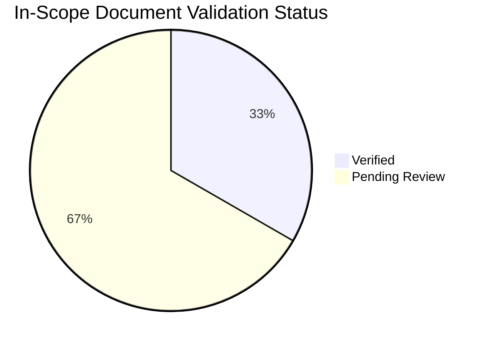

---
content_sources:
  references:
    - type: self-generated
      justification: Auto-generated dashboard tracking content validation status
---

# Content Validation Status

This page tracks `content_validation` metadata for **in-scope factual-claim documents** under `docs/best-practices/`, `docs/operations/`, `docs/platform/`, `docs/troubleshooting/`. Pages outside this scope — navigation indexes (`docs/best-practices/index.md`, `docs/operations/index.md`, `docs/platform/index.md`, `docs/troubleshooting/first-10-minutes/index.md`, `docs/troubleshooting/index.md`, `docs/troubleshooting/playbooks/index.md`), tutorials, reference pages, and excluded troubleshooting subpaths (`docs/troubleshooting/kql/`, `docs/troubleshooting/lab-guides/`) — are not counted here. See `scripts/lib/content_scope.py` for the executable scope definition.

## Summary

*Generated: 2026-07-25*

| Content Type | Total | Verified | Pending | Unverified | No Metadata |
|---|---:|---:|---:|---:|---:|
| Mermaid Diagrams | 85 | 85 | 0 | 0 | 0 |
| In-Scope Factual-Claim Documents | 48 | 16 | 32 | 0 | 0 |


<!-- diagram-id: content-validation-status-pie -->

```mermaid
pie title In-Scope Document Validation Status
    "Verified" : 16
    "Pending Review" : 32
```

## By Section

### Platform

| Document | Has Sources | Status | Claims | Last Reviewed |
|---|---|---|---|---|
| [Dns Basics](../platform/dns-basics.md) | ✅ | ⚠️ Pending Review | 0/2 | 2026-07-25 |
| [How Azure Networking Works](../platform/how-azure-networking-works.md) | ✅ | ⚠️ Pending Review | 0/2 | 2026-07-25 |
| [Hybrid Connectivity Basics](../platform/hybrid-connectivity-basics.md) | ✅ | ⚠️ Pending Review | 0/2 | 2026-07-25 |
| [Ip Addressing](../platform/ip-addressing.md) | ✅ | ⚠️ Pending Review | 0/2 | 2026-07-25 |
| [Load Balancing Options](../platform/load-balancing-options.md) | ✅ | ⚠️ Pending Review | 0/2 | 2026-07-25 |
| [Network Security Basics](../platform/network-security-basics.md) | ✅ | ⚠️ Pending Review | 0/2 | 2026-07-25 |
| [Private Connectivity Options](../platform/private-connectivity-options.md) | ✅ | ⚠️ Pending Review | 0/2 | 2026-07-25 |
| [Routing Basics](../platform/routing-basics.md) | ✅ | ⚠️ Pending Review | 0/2 | 2026-07-25 |
| [Vnet And Subnet Basics](../platform/vnet-and-subnet-basics.md) | ✅ | ⚠️ Pending Review | 0/2 | 2026-07-25 |

### Best Practices

| Document | Has Sources | Status | Claims | Last Reviewed |
|---|---|---|---|---|
| [Common Anti Patterns](../best-practices/common-anti-patterns.md) | ✅ | ⚠️ Pending Review | 0/2 | 2026-07-25 |
| [Cost Awareness Best Practices](../best-practices/cost-awareness-best-practices.md) | ✅ | ✅ Verified | 2/2 | 2026-07-25 |
| [Dns Best Practices](../best-practices/dns-best-practices.md) | ✅ | ✅ Verified | 2/2 | 2026-07-25 |
| [Hybrid Connectivity Best Practices](../best-practices/hybrid-connectivity-best-practices.md) | ✅ | ✅ Verified | 2/2 | 2026-07-25 |
| [Network Design Baseline](../best-practices/network-design-baseline.md) | ✅ | ⚠️ Pending Review | 0/2 | 2026-07-25 |
| [Nsg And Firewall Best Practices](../best-practices/nsg-and-firewall-best-practices.md) | ✅ | ✅ Verified | 2/2 | 2026-07-25 |
| [Observability Best Practices](../best-practices/observability-best-practices.md) | ✅ | ✅ Verified | 2/2 | 2026-07-25 |
| [Private Endpoint Best Practices](../best-practices/private-endpoint-best-practices.md) | ✅ | ✅ Verified | 2/2 | 2026-07-25 |
| [Routing Best Practices](../best-practices/routing-best-practices.md) | ✅ | ✅ Verified | 2/2 | 2026-07-25 |
| [Subnet Design Best Practices](../best-practices/subnet-design-best-practices.md) | ✅ | ⚠️ Pending Review | 0/2 | 2026-07-25 |

### Operations

| Document | Has Sources | Status | Claims | Last Reviewed |
|---|---|---|---|---|
| [Configure Dns](../operations/configure-dns.md) | ✅ | ✅ Verified | 3/3 | 2026-07-25 |
| [Configure Nsg](../operations/configure-nsg.md) | ✅ | ✅ Verified | 3/3 | 2026-07-25 |
| [Configure Udr](../operations/configure-udr.md) | ✅ | ✅ Verified | 3/3 | 2026-07-25 |
| [Connect Private Endpoints](../operations/connect-private-endpoints.md) | ✅ | ✅ Verified | 3/3 | 2026-07-25 |
| [Create Vnet And Subnets](../operations/create-vnet-and-subnets.md) | ✅ | ✅ Verified | 3/3 | 2026-07-25 |
| [Monitor Network Paths](../operations/monitor-network-paths.md) | ✅ | ✅ Verified | 3/3 | 2026-07-25 |
| [Packet Capture And Diagnostics](../operations/packet-capture-and-diagnostics.md) | ✅ | ✅ Verified | 3/3 | 2026-07-25 |
| [Peering Basics](../operations/peering-basics.md) | ✅ | ✅ Verified | 3/3 | 2026-07-25 |
| [Vpn And Expressroute Basics](../operations/vpn-and-expressroute-basics.md) | ✅ | ✅ Verified | 3/3 | 2026-07-25 |

### Troubleshooting

| Document | Has Sources | Status | Claims | Last Reviewed |
|---|---|---|---|---|
| [Architecture Overview](../troubleshooting/architecture-overview.md) | ✅ | ⚠️ Pending Review | 0/2 | 2026-07-25 |
| [Cannot Reach Private Endpoint](../troubleshooting/playbooks/connectivity/cannot-reach-private-endpoint.md) | ✅ | ⚠️ Pending Review | 0/2 | 2026-07-25 |
| [Connectivity](../troubleshooting/first-10-minutes/connectivity.md) | ✅ | ⚠️ Pending Review | 0/2 | 2026-07-25 |
| [Connectivity Failures](../troubleshooting/playbooks/connectivity-failures.md) | ✅ | ⚠️ Pending Review | 0/2 | 2026-07-25 |
| [Decision Tree](../troubleshooting/decision-tree.md) | ✅ | ⚠️ Pending Review | 0/2 | 2026-07-25 |
| [Dns](../troubleshooting/first-10-minutes/dns.md) | ✅ | ⚠️ Pending Review | 0/2 | 2026-07-25 |
| [Dns Resolution Failures](../troubleshooting/playbooks/dns/dns-resolution-failures.md) | ✅ | ⚠️ Pending Review | 0/2 | 2026-07-25 |
| [Evidence Map](../troubleshooting/evidence-map.md) | ✅ | ⚠️ Pending Review | 0/2 | 2026-07-25 |
| [Hybrid Connectivity Issues](../troubleshooting/playbooks/routing/hybrid-connectivity-issues.md) | ✅ | ⚠️ Pending Review | 0/2 | 2026-07-25 |
| [Inbound Connectivity Issues](../troubleshooting/playbooks/connectivity/inbound-connectivity-issues.md) | ✅ | ⚠️ Pending Review | 0/2 | 2026-07-25 |
| [Intermittent Network Failures](../troubleshooting/playbooks/connectivity/intermittent-network-failures.md) | ✅ | ⚠️ Pending Review | 0/2 | 2026-07-25 |
| [Latency And Packet Loss](../troubleshooting/playbooks/connectivity/latency-and-packet-loss.md) | ✅ | ⚠️ Pending Review | 0/2 | 2026-07-25 |
| [Load Balancer Health Probe Failures](../troubleshooting/playbooks/load-balancer-health-probe-failures.md) | ✅ | ⚠️ Pending Review | 0/2 | 2026-07-25 |
| [Mental Model](../troubleshooting/mental-model.md) | ✅ | ⚠️ Pending Review | 0/2 | 2026-07-25 |
| [Nsg Vs Udr Vs Firewall](../troubleshooting/playbooks/routing/nsg-vs-udr-vs-firewall.md) | ✅ | ⚠️ Pending Review | 0/2 | 2026-07-25 |
| [Outbound Connectivity Issues](../troubleshooting/playbooks/connectivity/outbound-connectivity-issues.md) | ✅ | ⚠️ Pending Review | 0/2 | 2026-07-25 |
| [Peering And Routing Issues](../troubleshooting/playbooks/routing/peering-and-routing-issues.md) | ✅ | ⚠️ Pending Review | 0/2 | 2026-07-25 |
| [Quick Diagnosis Cards](../troubleshooting/quick-diagnosis-cards.md) | ✅ | ⚠️ Pending Review | 0/2 | 2026-07-25 |
| [Routing](../troubleshooting/first-10-minutes/routing.md) | ✅ | ⚠️ Pending Review | 0/2 | 2026-07-25 |
| [Vpn Gateway Troubleshooting](../troubleshooting/playbooks/vpn-gateway-troubleshooting.md) | ✅ | ⚠️ Pending Review | 0/2 | 2026-07-25 |

## Validation Status

| Status | Description |
|---|---|
| `verified` | All core claims traced to Microsoft Learn sources |
| `pending_review` | Document exists but claims need source verification |
| `unverified` | New document, no validation performed |

## How to Add Validation

For an in-scope page, add a `content_validation` block to its frontmatter:

```yaml
---
content_validation:
  status: verified
  last_reviewed: 2026-07-25
  reviewer: agent
  core_claims:
    - claim: "Azure Virtual Network supports isolated private IP address spaces for Azure resources."
      source: https://learn.microsoft.com/en-us/azure/virtual-network/virtual-networks-overview
      verified: true
---
```

Each `core_claim` must be a verifiable factual assertion about Azure networking behavior. Claims containing `primary source basis` are rejected as tautological placeholders.

Then regenerate this page:

```bash
python3 scripts/generate_content_validation_status.py
```

## See Also

- [Tutorial Validation Status](validation-status.md)
- [Connectivity Decision Guide](connectivity-decision-guide.md)

