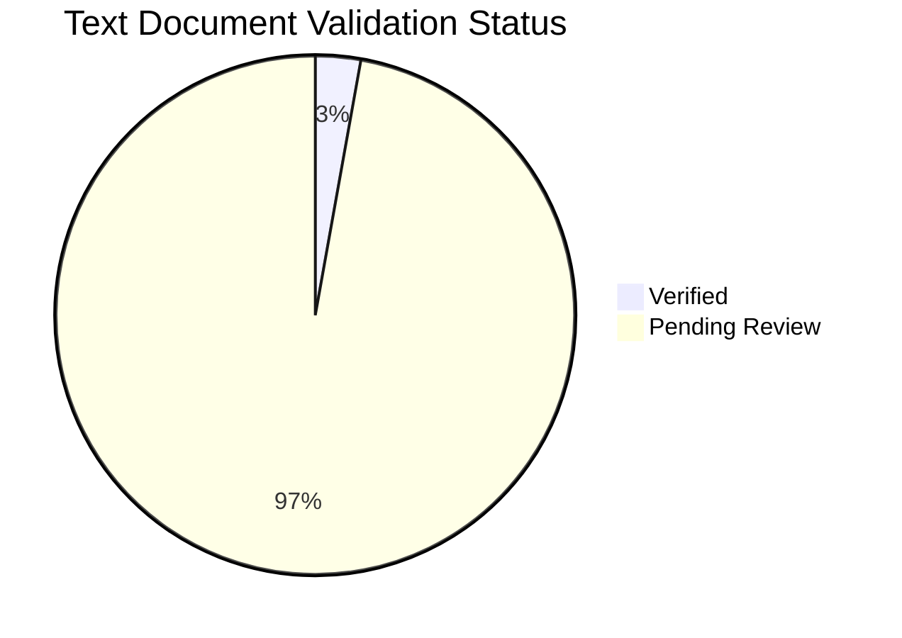

---
content_sources:
  diagrams:
  - id: content-validation-status-pie
    type: pie
    source: self-generated
    justification: Auto-generated dashboard from repository frontmatter.
  sources:
  - type: mslearn-adapted
    url: https://learn.microsoft.com/en-us/azure/networking/networking-overview
content_validation:
  status: verified
  last_reviewed: '2026-05-23'
  reviewer: ai-agent
  core_claims:
  - claim: This dashboard is generated from content_validation frontmatter in this
      repository.
    source: scripts/generate_content_validation_status.py
    verified: true
  - claim: The repository content policy requires Microsoft Learn traceability for
      core Azure networking guidance.
    source: AGENTS.md
    verified: true
---
# Content Validation Status

This page is generated from `content_validation` frontmatter across non-tutorial documentation. It distinguishes verified pages from pages that have metadata but still need text-level source review.

## Summary

*Generated: 2026-05-23*

| Content Type | Total | Verified | Pending | Unverified | No Metadata |
|---|---:|---:|---:|---:|---:|
| Mermaid Diagrams | 82 | 82 | 0 | 0 | 0 |
| Text Documents | 71 | 2 | 69 | 0 | 0 |

<!-- diagram-id: content-validation-status-pie -->

```mermaid
pie title Text Document Validation Status
    "Verified" : 2
    "Pending Review" : 69
```

## By Section

### Root

| Document | Sources | Status | Claims | Last Reviewed |
|---|---|---|---:|---|
| [Index](../index.md) | yes | Pending Review | 0/2 | 2026-05-22 |

### Start Here

| Document | Sources | Status | Claims | Last Reviewed |
|---|---|---|---:|---|
| [Common Scenarios](../start-here/common-scenarios.md) | yes | Pending Review | 0/2 | 2026-05-22 |
| [Index](../start-here/index.md) | yes | Pending Review | 0/2 | 2026-05-22 |
| [Learning Path](../start-here/learning-path.md) | yes | Pending Review | 0/2 | 2026-05-22 |
| [Networking Vs Connectivity](../start-here/networking-vs-connectivity.md) | yes | Pending Review | 0/2 | 2026-05-22 |
| [Overview](../start-here/overview.md) | yes | Pending Review | 0/2 | 2026-05-22 |

### Platform

| Document | Sources | Status | Claims | Last Reviewed |
|---|---|---|---:|---|
| [Dns Basics](../platform/dns-basics.md) | yes | Pending Review | 0/2 | 2026-05-22 |
| [How Azure Networking Works](../platform/how-azure-networking-works.md) | yes | Pending Review | 0/2 | 2026-05-22 |
| [Hybrid Connectivity Basics](../platform/hybrid-connectivity-basics.md) | yes | Pending Review | 0/2 | 2026-05-22 |
| [Index](../platform/index.md) | yes | Pending Review | 0/2 | 2026-05-22 |
| [Ip Addressing](../platform/ip-addressing.md) | yes | Pending Review | 0/2 | 2026-05-22 |
| [Load Balancing Options](../platform/load-balancing-options.md) | yes | Pending Review | 0/2 | 2026-05-22 |
| [Network Security Basics](../platform/network-security-basics.md) | yes | Pending Review | 0/2 | 2026-05-22 |
| [Private Connectivity Options](../platform/private-connectivity-options.md) | yes | Pending Review | 0/2 | 2026-05-22 |
| [Routing Basics](../platform/routing-basics.md) | yes | Pending Review | 0/2 | 2026-05-22 |
| [Vnet And Subnet Basics](../platform/vnet-and-subnet-basics.md) | yes | Pending Review | 0/2 | 2026-05-22 |

### Best Practices

| Document | Sources | Status | Claims | Last Reviewed |
|---|---|---|---:|---|
| [Common Anti Patterns](../best-practices/common-anti-patterns.md) | yes | Pending Review | 0/2 | 2026-05-22 |
| [Cost Awareness Best Practices](../best-practices/cost-awareness-best-practices.md) | yes | Pending Review | 0/2 | 2026-05-22 |
| [Dns Best Practices](../best-practices/dns-best-practices.md) | yes | Pending Review | 0/2 | 2026-05-22 |
| [Hybrid Connectivity Best Practices](../best-practices/hybrid-connectivity-best-practices.md) | yes | Pending Review | 0/2 | 2026-05-22 |
| [Index](../best-practices/index.md) | yes | Pending Review | 0/2 | 2026-05-22 |
| [Network Design Baseline](../best-practices/network-design-baseline.md) | yes | Pending Review | 0/2 | 2026-05-22 |
| [Nsg And Firewall Best Practices](../best-practices/nsg-and-firewall-best-practices.md) | yes | Pending Review | 0/2 | 2026-05-22 |
| [Observability Best Practices](../best-practices/observability-best-practices.md) | yes | Pending Review | 0/2 | 2026-05-22 |
| [Private Endpoint Best Practices](../best-practices/private-endpoint-best-practices.md) | yes | Pending Review | 0/2 | 2026-05-22 |
| [Routing Best Practices](../best-practices/routing-best-practices.md) | yes | Pending Review | 0/2 | 2026-05-22 |
| [Subnet Design Best Practices](../best-practices/subnet-design-best-practices.md) | yes | Pending Review | 0/2 | 2026-05-22 |

### Operations

| Document | Sources | Status | Claims | Last Reviewed |
|---|---|---|---:|---|
| [Configure Dns](../operations/configure-dns.md) | yes | Pending Review | 0/2 | 2026-05-22 |
| [Configure Nsg](../operations/configure-nsg.md) | yes | Pending Review | 0/2 | 2026-05-22 |
| [Configure Udr](../operations/configure-udr.md) | yes | Pending Review | 0/2 | 2026-05-22 |
| [Connect Private Endpoints](../operations/connect-private-endpoints.md) | yes | Pending Review | 0/2 | 2026-05-22 |
| [Create Vnet And Subnets](../operations/create-vnet-and-subnets.md) | yes | Pending Review | 0/2 | 2026-05-22 |
| [Index](../operations/index.md) | yes | Pending Review | 0/2 | 2026-05-22 |
| [Monitor Network Paths](../operations/monitor-network-paths.md) | yes | Pending Review | 0/2 | 2026-05-22 |
| [Packet Capture And Diagnostics](../operations/packet-capture-and-diagnostics.md) | yes | Pending Review | 0/2 | 2026-05-22 |
| [Peering Basics](../operations/peering-basics.md) | yes | Pending Review | 0/2 | 2026-05-22 |
| [Vpn And Expressroute Basics](../operations/vpn-and-expressroute-basics.md) | yes | Pending Review | 0/2 | 2026-05-22 |

### Troubleshooting

| Document | Sources | Status | Claims | Last Reviewed |
|---|---|---|---:|---|
| [Architecture Overview](../troubleshooting/architecture-overview.md) | yes | Pending Review | 0/2 | 2026-05-22 |
| [Decision Tree](../troubleshooting/decision-tree.md) | yes | Pending Review | 0/2 | 2026-05-22 |
| [Evidence Map](../troubleshooting/evidence-map.md) | yes | Pending Review | 0/2 | 2026-05-22 |
| [Connectivity](../troubleshooting/first-10-minutes/connectivity.md) | yes | Pending Review | 0/2 | 2026-05-22 |
| [Dns](../troubleshooting/first-10-minutes/dns.md) | yes | Pending Review | 0/2 | 2026-05-22 |
| [Index](../troubleshooting/first-10-minutes/index.md) | yes | Pending Review | 0/2 | 2026-05-22 |
| [Routing](../troubleshooting/first-10-minutes/routing.md) | yes | Pending Review | 0/2 | 2026-05-22 |
| [Index](../troubleshooting/index.md) | yes | Pending Review | 0/2 | 2026-05-22 |
| [Mental Model](../troubleshooting/mental-model.md) | yes | Pending Review | 0/2 | 2026-05-22 |
| [Connectivity Failures](../troubleshooting/playbooks/connectivity-failures.md) | yes | Pending Review | 0/2 | 2026-05-22 |
| [Cannot Reach Private Endpoint](../troubleshooting/playbooks/connectivity/cannot-reach-private-endpoint.md) | yes | Pending Review | 0/2 | 2026-05-22 |
| [Inbound Connectivity Issues](../troubleshooting/playbooks/connectivity/inbound-connectivity-issues.md) | yes | Pending Review | 0/2 | 2026-05-22 |
| [Intermittent Network Failures](../troubleshooting/playbooks/connectivity/intermittent-network-failures.md) | yes | Pending Review | 0/2 | 2026-05-22 |
| [Latency And Packet Loss](../troubleshooting/playbooks/connectivity/latency-and-packet-loss.md) | yes | Pending Review | 0/2 | 2026-05-22 |
| [Outbound Connectivity Issues](../troubleshooting/playbooks/connectivity/outbound-connectivity-issues.md) | yes | Pending Review | 0/2 | 2026-05-22 |
| [Dns Resolution Issues](../troubleshooting/playbooks/dns-resolution-issues.md) | yes | Pending Review | 0/2 | 2026-05-22 |
| [Dns Resolution Failures](../troubleshooting/playbooks/dns/dns-resolution-failures.md) | yes | Pending Review | 0/2 | 2026-05-22 |
| [Index](../troubleshooting/playbooks/index.md) | yes | Pending Review | 0/2 | 2026-05-22 |
| [Load Balancer Health Probe Failures](../troubleshooting/playbooks/load-balancer-health-probe-failures.md) | yes | Pending Review | 0/2 | 2026-05-22 |
| [Hybrid Connectivity Issues](../troubleshooting/playbooks/routing/hybrid-connectivity-issues.md) | yes | Pending Review | 0/2 | 2026-05-22 |
| [Nsg Vs Udr Vs Firewall](../troubleshooting/playbooks/routing/nsg-vs-udr-vs-firewall.md) | yes | Pending Review | 0/2 | 2026-05-22 |
| [Peering And Routing Issues](../troubleshooting/playbooks/routing/peering-and-routing-issues.md) | yes | Pending Review | 0/2 | 2026-05-22 |
| [Vpn Gateway Troubleshooting](../troubleshooting/playbooks/vpn-gateway-troubleshooting.md) | yes | Pending Review | 0/2 | 2026-05-22 |
| [Quick Diagnosis Cards](../troubleshooting/quick-diagnosis-cards.md) | yes | Pending Review | 0/2 | 2026-05-22 |

### Reference

| Document | Sources | Status | Claims | Last Reviewed |
|---|---|---|---:|---|
| [Azure Networking Components](../reference/azure-networking-components.md) | yes | Pending Review | 0/2 | 2026-05-22 |
| [Connectivity Decision Guide](../reference/connectivity-decision-guide.md) | yes | Pending Review | 0/2 | 2026-05-22 |
| [Content Validation Status](../reference/content-validation-status.md) | yes | Verified | 2/2 | 2026-05-22 |
| [Dns Resolution Cheatsheet](../reference/dns-resolution-cheatsheet.md) | yes | Pending Review | 0/2 | 2026-05-22 |
| [Glossary](../reference/glossary.md) | yes | Pending Review | 0/2 | 2026-05-22 |
| [Index](../reference/index.md) | yes | Pending Review | 0/2 | 2026-05-22 |
| [Private Connectivity Options](../reference/private-connectivity-options.md) | yes | Pending Review | 0/2 | 2026-05-22 |
| [Routing Cheatsheet](../reference/routing-cheatsheet.md) | yes | Pending Review | 0/2 | 2026-05-22 |
| [Validation Status](../reference/validation-status.md) | yes | Verified | 2/2 | 2026-05-22 |

### Contributing

| Document | Sources | Status | Claims | Last Reviewed |
|---|---|---|---:|---|
| [Index](../contributing/index.md) | no | Pending Review | 0/2 | 2026-05-22 |

## How to Update

Add or update `content_validation` in a document's YAML frontmatter, then regenerate this page:

```bash
python3 scripts/generate_content_validation_status.py
```

| Field | Meaning |
|---|---|
| `status` | `verified`, `pending_review`, or `unverified` |
| `last_reviewed` | Date when the claims were last checked |
| `core_claims` | The factual claims tracked for source validation |

## See Also

- [Validation Status](validation-status.md)
- [Connectivity Decision Guide](connectivity-decision-guide.md)
- [Azure Networking Components](azure-networking-components.md)

## Sources

- [Microsoft Learn overview](https://learn.microsoft.com/en-us/azure/networking/networking-overview)
