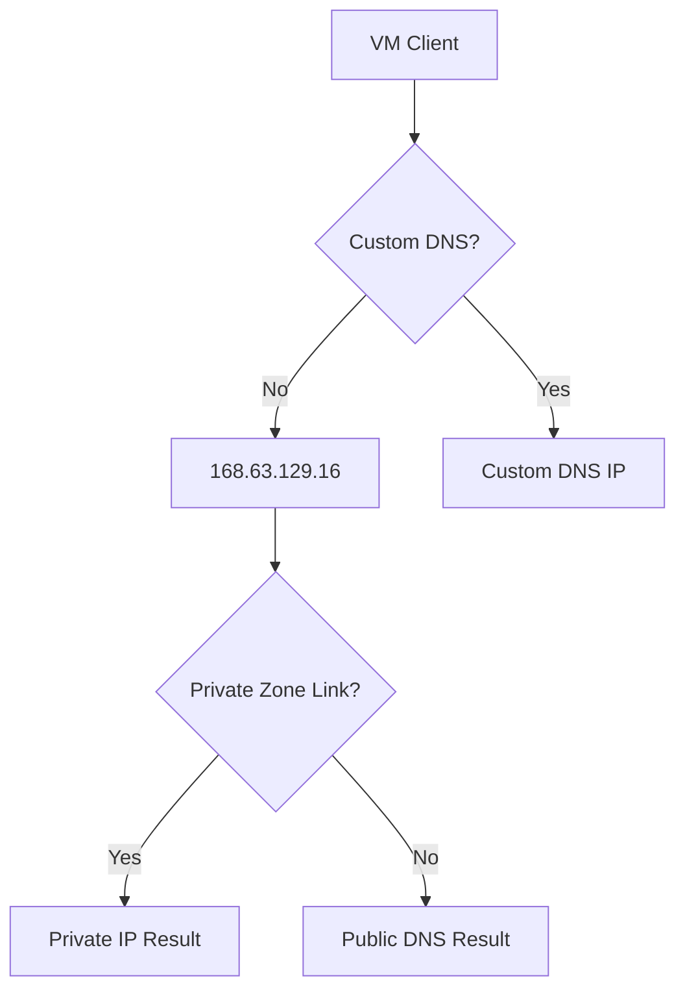

---
hide:
  - toc
content_sources:
  diagrams:
    - id: dns-resolution-cheatsheet
      type: flowchart
      source: self-generated
      justification: "Synthesized quick-reference diagram for this guide from Microsoft Learn networking documentation."
      based_on:
        - https://learn.microsoft.com/en-us/azure/dns/private-dns-overview
        - https://learn.microsoft.com/en-us/azure/virtual-network/virtual-networks-name-resolution-for-vms-and-role-instances
        - https://learn.microsoft.com/en-us/azure/dns/dns-private-resolver-overview
---

# DNS Resolution Cheatsheet

Reference for DNS behavior within Azure Virtual Networks and hybrid environments.

| Scenario | DNS Behavior | Mechanism |
| :--- | :--- | :--- |
| Azure-provided | Default resolution | 168.63.129.16 recursive resolver |
| Custom DNS | Specified in VNet | Queries sent to custom IP (e.g., AD DC) |
| Private DNS Zone | Resolves custom domain | Linked to VNet via Virtual Network Link |
| PE Resolution | FQDN to Private IP | Canonical name (CNAME) mapping to PE IP |
| Hybrid Forwarding | Resolve on-prem/cloud | Private Resolver / Inbound-Outbound Endpoints |

| nslookup Result | Meaning | Root Cause |
| :--- | :--- | :--- |
| NXDOMAIN | Domain not found | Missing record or wrong search suffix |
| SERVFAIL | Failure to resolve | Recursive resolver or forwarder issue |
| Timeout | No response | Network blockage (NSG/FW) or invalid DNS IP |
| Correct IP | Successful resolution | Record and VNet Link properly configured |

<!-- diagram-id: dns-resolution-cheatsheet -->

!!! note
    DNS changes are not immediate for every client; cached entries can delay observed results.

## See Also

- [DNS Basics](../platform/dns-basics.md)
- [DNS Best Practices](../best-practices/dns-best-practices.md)
- [Configure DNS](../operations/configure-dns.md)

## Sources

- [Azure DNS Private Zones documentation](https://learn.microsoft.com/en-us/azure/dns/private-dns-overview)
- [Name resolution for resources in Azure VNets](https://learn.microsoft.com/en-us/azure/virtual-network/virtual-networks-name-resolution-for-vms-and-role-instances)
- [Azure DNS Private Resolver documentation](https://learn.microsoft.com/en-us/azure/dns/dns-private-resolver-overview)
