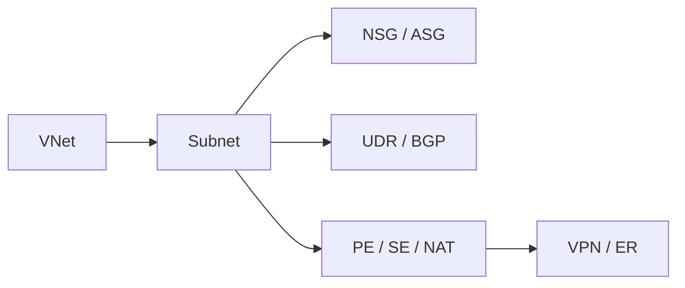

---
hide:
  - toc
---

# Glossary

Definitions of core Azure networking terms for quick lookup.

| Term | Definition |
| :--- | :--- |
| VNet | Virtual Network; your private cloud network. |
| Subnet | Range of IP addresses within a VNet. |
| NSG | Network Security Group; rule-based traffic filter. |
| UDR | User Defined Route; custom routing entry. |
| NIC | Network Interface; connects VM to VNet. |
| Public IP | IP reachable from the internet. |
| Private Endpoint | Private IP for a specific Azure service. |
| Service Endpoint | Securely links VNet to PaaS services. |
| NAT Gateway | Scalable outbound internet connectivity. |
| Azure Firewall | Managed cloud-native network security. |
| Load Balancer | Distributes TCP/UDP traffic at Layer 4. |
| App Gateway | HTTP load balancer with WAF at Layer 7. |
| Front Door | Global entry point for web applications. |
| VPN Gateway | Encrypted cross-premises connectivity. |
| ExpressRoute | Dedicated private connection to Azure. |
| Private DNS | Resolution for domains within VNets. |
| Network Watcher | Tools for diagnostic monitoring. |
| Peering | Low-latency connection between VNets. |
| Hub-Spoke | Central hub VNet connected to spokes. |
| SNAT | Source Network Address Translation. |
| BGP | Protocol for dynamic route exchange. |
| Route Table | Collection of routes applied to subnets. |

!!! note
    Terms may overlap across Azure services; always confirm exact behavior in the linked product documentation.

## See Also

- [Azure Networking Components](./azure-networking-components.md)
- [Overview](../start-here/overview.md)
- [Platform Index](../platform/index.md)

## Sources

- [Azure Virtual Network terminology](https://learn.microsoft.com/en-us/azure/virtual-network/virtual-networks-overview)
- [Azure networking fundamental concepts](https://learn.microsoft.com/en-us/training/modules/azure-networking-fundamentals/)
- [Microsoft Learn: Cloud networking terms](https://learn.microsoft.com/en-us/azure/architecture/guide/networking/networking-start-here)
