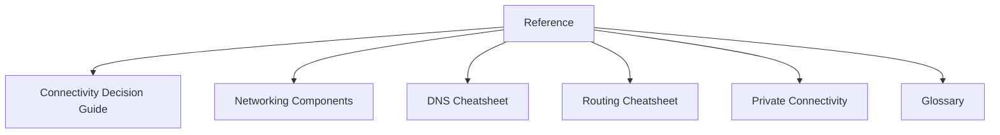

# Reference

Reference section for the Azure Networking Practical Guide. Use these pages for quick lookup of components, routing, and DNS behavior.

| Page | Description |
| :--- | :--- |
| Connectivity Decision Guide | Recommended approach based on scenario requirements. |
| Azure Networking Components | Breakdown of VNet, Subnet, NSG, and other core resources. |
| DNS Resolution Cheatsheet | Behavior of Azure-provided vs custom DNS. |
| Routing Cheatsheet | Route precedence and next hop types. |
| Private Connectivity Options | Comparison of Private Endpoints and Service Endpoints. |
| Glossary | Definitions of 20+ core networking terms. |

## Sources

- [Azure Architecture Center: Networking](https://learn.microsoft.com/en-us/azure/architecture/guide/networking/networking-start-here)
- [Azure Virtual Network documentation](https://learn.microsoft.com/en-us/azure/virtual-network/)
- [Azure DNS documentation](https://learn.microsoft.com/en-us/azure/dns/)
