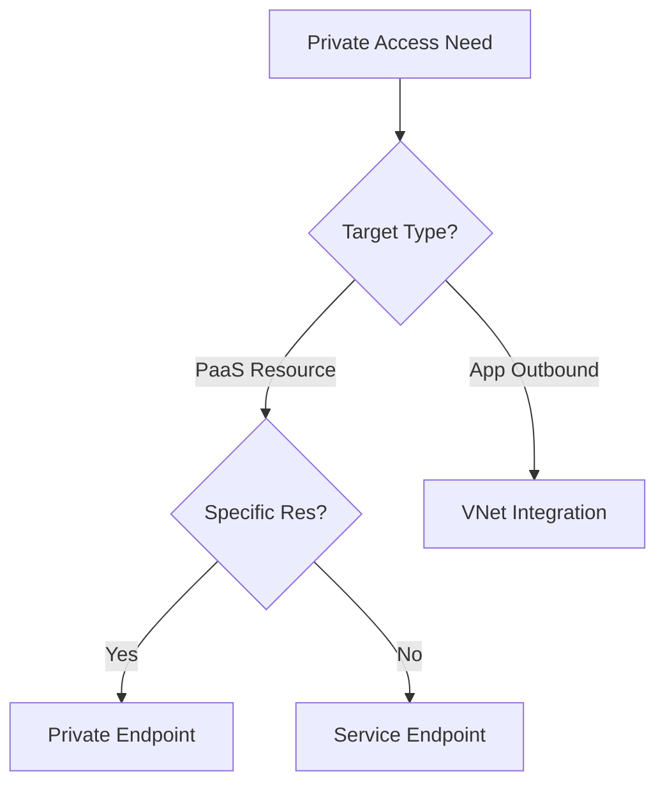

# Private Connectivity Options

Comparison of methods to connect Azure services privately within a Virtual Network.

| Feature | Private Endpoint (PE) | Service Endpoint (SE) | VNet Integration |
| :--- | :--- | :--- | :--- |
| DNS Impact | FQDN points to Private IP | Public IP resolved | N/A (App Service only) |
| Security | NSG support (Inbound) | VNet service rules (Outbound) | NSG support (Outbound) |
| Scope | Specific resource instance | Entire service in region | App Service to VNet |
| Cost | Hourly rate + data transfer | Free | Free (Plan dependent) |
| Services | Most PaaS & Link Services | Key PaaS (Storage, SQL) | App Service, Functions |

!!! note
    Migration from Service Endpoints to Private Endpoints is recommended for enhanced security, as PEs provide a private IP within your VNet and granular resource access.

## Sources

- [What is Azure Private Endpoint?](https://learn.microsoft.com/en-us/azure/private-link/private-endpoint-overview)
- [Virtual Network Service Endpoints](https://learn.microsoft.com/en-us/azure/virtual-network/virtual-network-service-endpoints-overview)
- [App Service VNet Integration](https://learn.microsoft.com/en-us/azure/app-service/overview-vnet-integration)
