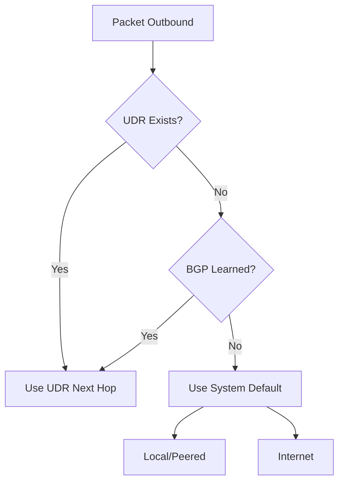

# Routing Cheatsheet

Quick reference for Azure Virtual Network routing precedence and next hop behavior.

| Route Type | Precedence | Source | Behavior |
| :--- | :--- | :--- | :--- |
| System | 1 (Implicit) | Azure | Default routes for VNet, Internet, None |
| UDR | 2 (Explicit) | Admin | User-defined overrides (highest priority) |
| BGP | 3 (Dynamic) | ExpressRoute/VPN | Routes learned from on-premises |
| Service | 4 (Implicit) | Private Link/SE | Routing to specific Azure PaaS |

| Next Hop Type | Description | Common Use Case |
| :--- | :--- | :--- |
| Virtual Appliance | Sends traffic to an NVA (Firewall) | Hub-spoke security inspection |
| Virtual Network Gateway| Sends traffic to VPN/ER Gateway | Hybrid on-premises connectivity |
| Virtual Network | Default local routing | Intra-VNet or peered VNet traffic |
| Internet | Direct to public internet | Default outbound (if not overridden) |
| None | Drops the packet | Security "blackhole" routing |

## Sources

- [Azure Virtual Network routing overview](https://learn.microsoft.com/en-us/azure/virtual-network/virtual-networks-udr-overview)
- [Route selection and precedence](https://learn.microsoft.com/en-us/azure/virtual-network/virtual-networks-udr-overview#how-azure-selects-a-route)
- [BGP and User Defined Routes](https://learn.microsoft.com/en-us/azure/virtual-network/virtual-networks-udr-overview#border-gateway-protocol-bgp)
