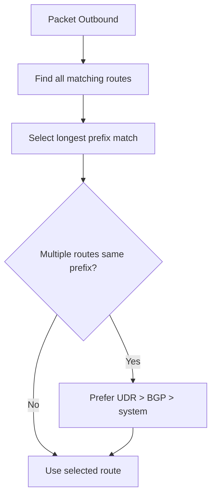

# Routing Cheatsheet

Quick reference for Azure Virtual Network routing precedence and next hop behavior.

| Route Selection Rule | Priority | Details |
| :--- | :--- | :--- |
| Longest prefix match | 1 (highest) | Azure first selects the most specific matching prefix (for example, /24 over /16). |
| UDR vs BGP vs System (equal prefixes) | 2 | If matching prefixes are identical, User-Defined Route (UDR) is preferred. |
| BGP vs System (equal prefixes, no UDR) | 3 | If no UDR exists for that prefix, BGP-learned route is preferred over system route. |
| System route fallback | 4 | Used when no UDR or BGP route with the same prefix is present. |

| Next Hop Type | Description | Common Use Case |
| :--- | :--- | :--- |
| Virtual Appliance | Sends traffic to an NVA (Firewall) | Hub-spoke security inspection |
| Virtual Network Gateway| Sends traffic to VPN/ER Gateway | Hybrid on-premises connectivity |
| Virtual Network | Default local routing | Intra-VNet or peered VNet traffic |
| Internet | Direct to public internet | Default outbound (if not overridden) |
| None | Drops the packet | Security "blackhole" routing |

!!! tip
    Validate effective routes on NICs after UDR or BGP changes to confirm expected next hop selection.

!!! note
    Service endpoint system routes cannot be overridden. VNet and peering routes are preferred but can be overridden by UDRs in supported service chaining scenarios.

## See Also

- [Routing Basics](../platform/routing-basics.md)
- [Routing Best Practices](../best-practices/routing-best-practices.md)
- [Configure UDR](../operations/configure-udr.md)

## Sources

- [Azure Virtual Network routing overview](https://learn.microsoft.com/en-us/azure/virtual-network/virtual-networks-udr-overview)
- [Route selection and precedence](https://learn.microsoft.com/en-us/azure/virtual-network/virtual-networks-udr-overview#how-azure-selects-a-route)
- [BGP and User Defined Routes](https://learn.microsoft.com/en-us/azure/virtual-network/virtual-networks-udr-overview#border-gateway-protocol-bgp)
