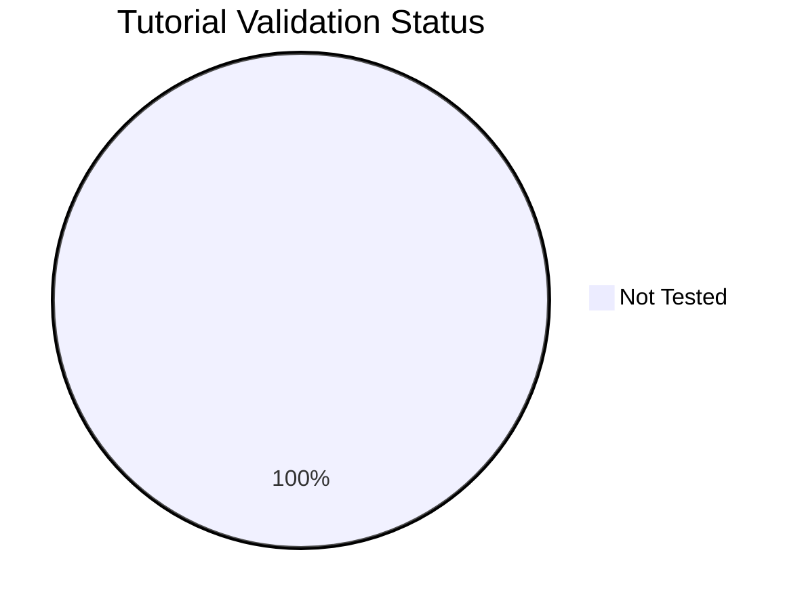

---
content_sources:
  diagrams:
    - id: summary
      type: pie
      source: self-generated
      justification: "Status visualization generated for this guide and grounded in the Microsoft Learn service references listed below."
      based_on:
        - https://learn.microsoft.com/en-us/azure/networking/networking-overview
        - https://learn.microsoft.com/en-us/azure/virtual-network/virtual-networks-overview
---

# Tutorial Validation Status

This page tracks which lab guides have been validated against real Azure deployments. Each guide can be tested via **az-cli** (manual CLI commands) or **Bicep** (infrastructure as code). Guides not tested within 90 days are marked as stale.

## Summary

*Generated: 2026-04-09*

| Metric | Count |
|---|---:|
| Total lab guides | 5 |
| ✅ Validated | 0 |
| ⚠️ Stale (>90 days) | 0 |
| ❌ Failed | 0 |
| ➖ Not tested | 5 |

<!-- diagram-id: summary -->


## Validation Matrix

| Lab Guide | az-cli | Bicep | Last Tested | Status |
|---|---|---|---|---|
| [Lab 01 Hub Spoke Topology](../tutorials/lab-guides/lab-01-hub-spoke-topology.md) | ➖ No Data | ➖ No Data | — | ➖ Not Tested |
| [Lab 02 Private Endpoints](../tutorials/lab-guides/lab-02-private-endpoints.md) | ➖ No Data | ➖ No Data | — | ➖ Not Tested |
| [Lab 03 Application Gateway Waf](../tutorials/lab-guides/lab-03-application-gateway-waf.md) | ➖ No Data | ➖ No Data | — | ➖ Not Tested |
| [Lab 04 Azure Firewall](../tutorials/lab-guides/lab-04-azure-firewall.md) | ➖ No Data | ➖ No Data | — | ➖ Not Tested |
| [Lab 05 Expressroute Simulation](../tutorials/lab-guides/lab-05-expressroute-simulation.md) | ➖ No Data | ➖ No Data | — | ➖ Not Tested |

## How to Update

To mark a lab guide as validated, add a `validation` block to its YAML frontmatter:

```yaml
---
hide:
  - toc
validation:
  az_cli:
    last_tested: 2026-04-09
    cli_version: "2.83.0"
    result: pass
  bicep:
    last_tested: null
    result: not_tested
---
```

Then regenerate this page:

```bash
python3 scripts/generate_validation_status.py
```

!!! info "Validation fields"
    - `result`: `pass`, `fail`, or `not_tested`
    - `last_tested`: ISO date (YYYY-MM-DD) or `null`
    - `cli_version`: Azure CLI version used
    - Lab guides older than 90 days are flagged as **stale**

## See Also

- [Tutorials](../tutorials/index.md)
- [Lab Guides](../tutorials/lab-guides/index.md)
- [Connectivity Decision Guide](connectivity-decision-guide.md)

