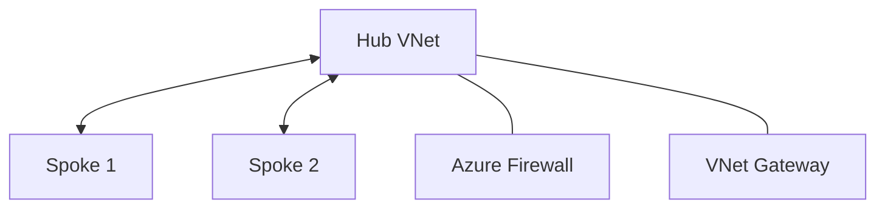

---
hide:
  - toc
---

# Common Scenarios

Understanding standard Azure networking patterns and their component requirements.

## Architecture Scenarios

| Scenario | Components | Focus |
|----------|------------|-------|
| Internet App | App Gateway, WAF | L7 Protection |
| Private App | Internal LB, Subnets | Isolation |
| Hub-Spoke | FW, VNet Peering | Centralized Egress |
| Hybrid | ExpressRoute, VPN | On-Prem Connect |
| SaaS / PE | Private Link, DNS | No Public IP |
| Multi-Region | Front Door, Global Peering | Latency / DR |

## Hub-Spoke Topology

!!! note
    Scenario selection depends on your compliance requirements. A simple internet-facing app may only need a public IP, whereas a highly secure enterprise app will likely use Hub-Spoke with Firewall.

## See Also

- [Create VNet and Subnets](../operations/create-vnet-and-subnets.md)
- [Connect Private Endpoints](../operations/connect-private-endpoints.md)
- [Troubleshooting Index](../troubleshooting/index.md)

## Sources
- [Azure Networking Scenarios](https://learn.microsoft.com/en-us/azure/architecture/networking/)
- [Hub-Spoke Topology](https://learn.microsoft.com/en-us/azure/architecture/reference-architectures/hybrid-networking/hub-spoke)
