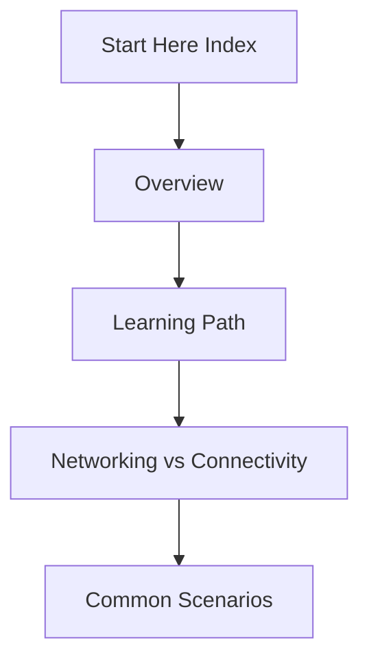

# Start Here

Kickstart your Azure networking journey with core mental models and pathfinders.

## Navigation

| Page | Description | Key Focus |
|------|-------------|-----------|
| [Overview](overview.md) | The Big Picture | Basic Azure networking topology |
| [Learning Path](learning-path.md) | Structured Reading | Where to focus based on your role |
| [Networking vs Connectivity](networking-vs-connectivity.md) | Diagnostic Mindset | How to frame networking problems |
| [Common Scenarios](common-scenarios.md) | Patterns and Use Cases | Hub-spoke, hybrid, and SaaS |

## Reading Path

!!! tip
    If you're already an experienced network engineer, skip to Networking vs Connectivity to understand how Azure's software-defined networking differs from physical infrastructure.

## Sources
- [Azure Virtual Network Documentation](https://learn.microsoft.com/en-us/azure/virtual-network/)
- [Azure Virtual Network Concepts](https://learn.microsoft.com/en-us/azure/virtual-network/virtual-networks-overview)
