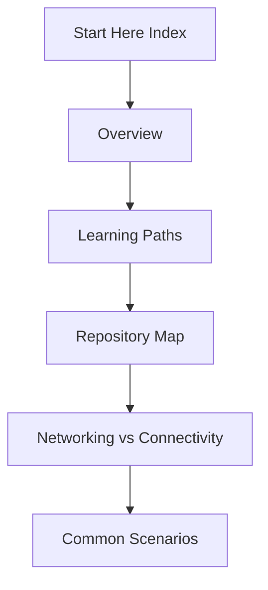

---
content_sources:
  diagrams:
    - id: reading-path
      type: flowchart
      source: self-generated
      justification: "Guide navigation diagram created for this repository and grounded in Microsoft Learn networking overview content."
      based_on:
        - https://learn.microsoft.com/en-us/azure/virtual-network/
        - https://learn.microsoft.com/en-us/azure/virtual-network/virtual-networks-overview
---

# Start Here

Kickstart your Azure networking journey with core mental models and pathfinders.

## Navigation

| Page | Description | Key Focus |
|------|-------------|-----------|
| [Overview](overview.md) | The Big Picture | Basic Azure networking topology |
| [Learning Paths](learning-paths.md) | Structured Reading | Where to focus based on your role |
| [Repository Map](repository-map.md) | Guide Structure | Map of major sections and when to use them |
| [Networking vs Connectivity](networking-vs-connectivity.md) | Diagnostic Mindset | How to frame networking problems |
| [Common Scenarios](common-scenarios.md) | Patterns and Use Cases | Hub-spoke, hybrid, and SaaS |

## Reading Path

<!-- diagram-id: reading-path -->

```mermaid
graph TD
    IN[Start Here Index] --> OV[Overview]
    OV --> LP[Learning Paths]
    LP --> RM[Repository Map]
    RM --> NC[Networking vs Connectivity]
    NC --> CS[Common Scenarios]
```

!!! tip
    If you're already an experienced network engineer, skip to Networking vs Connectivity to understand how Azure's software-defined networking differs from physical infrastructure.

## See Also

- [Overview](overview.md)
- [Learning Paths](learning-paths.md)
- [Repository Map](repository-map.md)
- [Networking vs Connectivity](networking-vs-connectivity.md)
- [Common Scenarios](common-scenarios.md)

## Sources
- [Azure Virtual Network Documentation](https://learn.microsoft.com/en-us/azure/virtual-network/)
- [Azure Virtual Network Concepts](https://learn.microsoft.com/en-us/azure/virtual-network/virtual-networks-overview)
