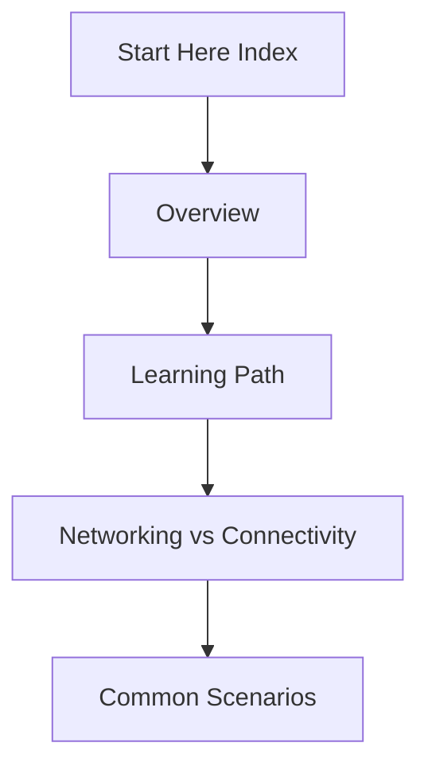

---
content_sources:
  diagrams:
  - id: reading-path
    type: flowchart
    source: self-generated
    justification: Guide navigation diagram created for this repository and grounded
      in Microsoft Learn networking overview content.
    based_on:
    - https://learn.microsoft.com/en-us/azure/virtual-network/
    - https://learn.microsoft.com/en-us/azure/virtual-network/virtual-networks-overview
content_validation:
  status: pending_review
  last_reviewed: '2026-05-22'
  reviewer: ai-agent
  core_claims:
  - claim: This document has source metadata and is queued for text-level Microsoft
      Learn verification.
    source: https://learn.microsoft.com/en-us/azure/virtual-network/
    verified: false
  - claim: Core Azure networking guidance on this page should remain traceable to
      the listed sources before it is marked verified.
    source: https://learn.microsoft.com/en-us/azure/virtual-network/
    verified: false
---

# Start Here

Kickstart your Azure networking journey with core mental models and pathfinders.

## Navigation

| Page | Description | Key Focus |
|------|-------------|-----------|
| [Overview](overview.md) | The Big Picture | Basic Azure networking topology |
| [Learning Path](learning-path.md) | Structured Reading | Where to focus based on your role |
| [Networking vs Connectivity](networking-vs-connectivity.md) | Diagnostic Mindset | How to frame networking problems |
| [Common Scenarios](common-scenarios.md) | Patterns and Use Cases | Hub-spoke, hybrid, and SaaS |

## Reading Path

<!-- diagram-id: reading-path -->

```mermaid
graph TD
    IN[Start Here Index] --> OV[Overview]
    OV --> LP[Learning Path]
    LP --> NC[Networking vs Connectivity]
    NC --> CS[Common Scenarios]
```

!!! tip
    If you're already an experienced network engineer, skip to Networking vs Connectivity to understand how Azure's software-defined networking differs from physical infrastructure.

## See Also

- [Overview](overview.md)
- [Learning Path](learning-path.md)
- [Networking vs Connectivity](networking-vs-connectivity.md)
- [Common Scenarios](common-scenarios.md)

## Sources
- [Azure Virtual Network Documentation](https://learn.microsoft.com/en-us/azure/virtual-network/)
- [Azure Virtual Network Concepts](https://learn.microsoft.com/en-us/azure/virtual-network/virtual-networks-overview)
