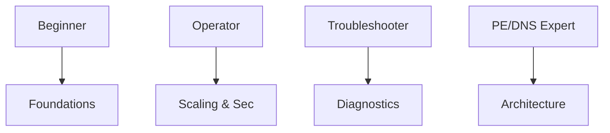

---
hide:
  - toc
content_sources:
  diagrams:
    - id: progression-flow
      type: flowchart
      source: self-generated
      justification: "Synthesized quick-reference diagram for this guide from Microsoft Learn networking documentation."
      based_on:
        - https://learn.microsoft.com/en-us/training/modules/azure-networking-fundamentals/
        - https://learn.microsoft.com/en-us/training/browse/?products=azure-networking
---

# Learning Path

Follow a tailored journey based on your professional role and needs.

## Path Recommendations

| Path | Audience | Page Sequence |
|------|----------|---------------|
| Beginner | Cloud Novice | Overview → Platform → Operations |
| Operator | SRE / SysAdmin | Platform → Operations → Best Practices |
| Troubleshooter | Support / Dev | Net vs Conn → Troubleshooting → Reference |
| PE/DNS Focus | App Architect | Overview → Private Endpoints → Reference |

## Progression Flow

<!-- diagram-id: progression-flow -->

!!! tip
    If you're in an urgent "outage" situation, skip the learning paths and head directly to [Troubleshooting](../troubleshooting/index.md).

## See Also

- [Overview](overview.md)
- [Platform Fundamentals](../platform/index.md)
- [Best Practices](../best-practices/index.md)

## Sources
- [Azure Networking Fundamentals](https://learn.microsoft.com/en-us/training/modules/azure-networking-fundamentals/)
- [Microsoft Learn Training Path](https://learn.microsoft.com/en-us/training/browse/?products=azure-networking)
