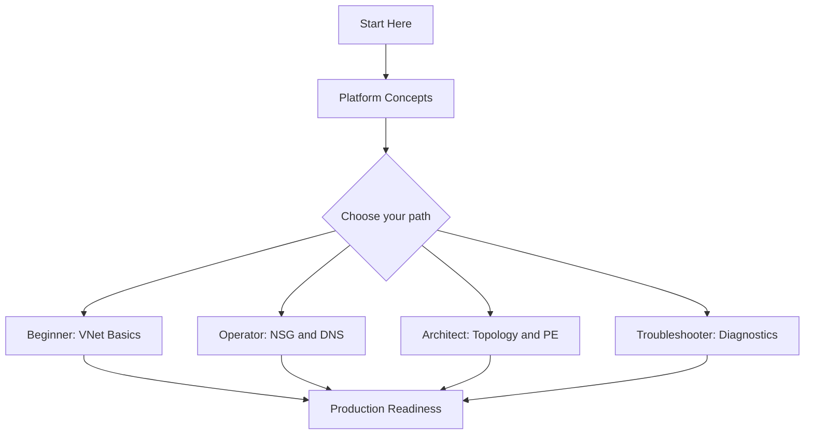
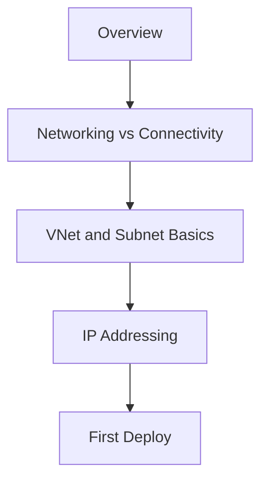
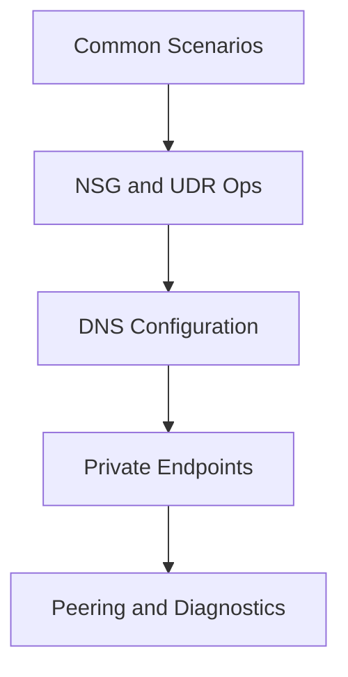
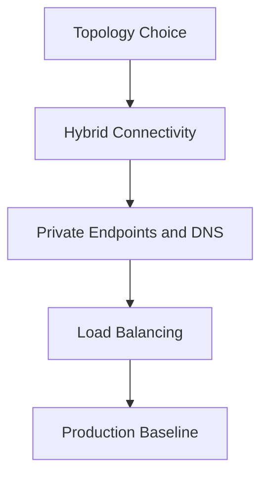
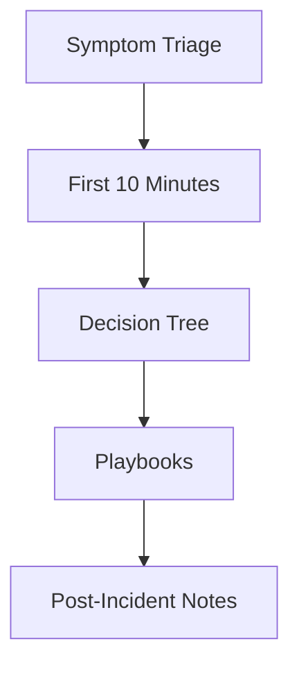

# Learning Paths

Use this page to choose a reading path based on your role and goal. Each path is numbered, so read the pages in order for the best result. Every path ends with a checklist of concrete outcomes you should be able to demonstrate.

!!! tip "Pick one primary path first"
    If you fit multiple roles, pick the one that matches your current goal, complete that path, then read a second path opportunistically. Trying to follow every path in parallel dilutes progress.

## Choose Your Path

| Role | Goal | Time Budget | Start With |
|---|---|---|---|
| **Beginner** | Understand VNets, subnets, and basic connectivity | 1-2 hours | [Overview](overview.md), [Networking vs Connectivity](networking-vs-connectivity.md) |
| **Operator** | Run day-2 network operations: NSG, DNS, UDR, peering | 3-4 hours | [Scenario Router](scenario-router.md), [Operations Hub](../operations/index.md) |
| **Architect** | Design hub-spoke, private endpoints, and DNS topology | 4-6 hours | [Platform Hub](../platform/index.md), [Best Practices Hub](../best-practices/index.md) |
| **Troubleshooter** | Diagnose connectivity, DNS, and routing failures | 2-4 hours + on-call reference | [Troubleshooting Hub](../troubleshooting/index.md) |

## Recommended Sequence

<!-- diagram-id: net-learning-paths-overview -->

## Beginner Path

Understand what an Azure Virtual Network is, how subnets and addressing work, and how to deploy your first VNet and test basic connectivity.

**Time**: 1-2 hours

<!-- diagram-id: net-learning-paths-beginner -->

Read in order:

1. [Overview](overview.md)
2. [Networking vs Connectivity](networking-vs-connectivity.md)
3. [Platform Hub](../platform/index.md) — VNet, subnet, IP addressing, DNS basics
4. [Scenario Router](scenario-router.md)
5. [Reference Hub](../reference/index.md) — glossary and cheatsheets

### Outcomes

- You can explain the difference between a VNet, subnet, and address space.
- You can deploy a VNet with two subnets via portal or CLI.
- You can name the four building blocks of Azure networking (VNet, NSG, UDR, DNS).
- You know where to find CLI reference and a glossary.

### Microsoft Learn anchors

- [Azure Virtual Network overview](https://learn.microsoft.com/en-us/azure/virtual-network/virtual-networks-overview)
- [Quickstart: Create a virtual network](https://learn.microsoft.com/en-us/azure/virtual-network/quick-create-portal)
- [IP address types in Azure](https://learn.microsoft.com/en-us/azure/virtual-network/ip-services/public-ip-addresses)

## Operator Path

Run day-2 network operations: create and manage NSGs and UDRs, configure DNS, wire private endpoints, and set up peering and diagnostics.

**Time**: 3-4 hours

<!-- diagram-id: net-learning-paths-operator -->

Read in order:

1. [Scenario Router](scenario-router.md)
2. [Operations Hub](../operations/index.md) — NSG, UDR, DNS, PE, peering, diagnostics
3. [Best Practices Hub](../best-practices/index.md) — DNS, NSG, PE production patterns
4. [Platform Hub](../platform/index.md) — network security and private connectivity basics
5. [Reference Hub](../reference/index.md) — DNS resolution and routing cheatsheets

### Outcomes

- You can create an NSG rule set that follows least-privilege and log to Log Analytics.
- You can configure a User-Defined Route table and attach it to a subnet.
- You can wire a Private Endpoint and validate DNS resolution through the Private DNS Zone.
- You can capture packets with Network Watcher and interpret the results.

### Microsoft Learn anchors

- [Manage network security groups](https://learn.microsoft.com/en-us/azure/virtual-network/manage-network-security-group)
- [Manage route tables](https://learn.microsoft.com/en-us/azure/virtual-network/manage-route-table)
- [Private Endpoint DNS integration](https://learn.microsoft.com/en-us/azure/private-link/private-endpoint-dns)

## Architect Path

Design hub-spoke or Virtual WAN topology, choose between VNet peering and hybrid connectivity, and define DNS and Private Endpoint strategy before workloads land.

**Time**: 4-6 hours

<!-- diagram-id: net-learning-paths-architect -->

Read in order:

1. [Platform Hub](../platform/index.md) — VNet, DNS, hybrid, load-balancing, private connectivity
2. [Best Practices Hub](../best-practices/index.md) — network design baseline, subnet design, hybrid, PE
3. [Reference Hub](../reference/index.md) — connectivity decision guide, private connectivity options
4. [Operations Hub](../operations/index.md) — operational implications of topology choices
5. [Troubleshooting Hub](../troubleshooting/index.md) — architecture overview and evidence map

### Outcomes

- You can decide between hub-spoke and Virtual WAN for a workload portfolio.
- You can design a Private DNS Zone strategy for Private Endpoints across VNets and on-prem.
- You can pick between VPN Gateway, ExpressRoute, and public routing for a hybrid link.
- You can document subnet sizing, NSG posture, and UDR intent for a new landing zone.

### Microsoft Learn anchors

- [Hub-spoke network topology](https://learn.microsoft.com/en-us/azure/architecture/reference-architectures/hybrid-networking/hub-spoke)
- [Private Endpoint overview](https://learn.microsoft.com/en-us/azure/private-link/private-endpoint-overview)
- [Azure DNS Private Resolver](https://learn.microsoft.com/en-us/azure/dns/dns-private-resolver-overview)

## Troubleshooter Path

Diagnose connectivity, DNS, and routing failures on Azure networking. Focuses on evidence-first triage and playbook selection.

**Time**: 2-4 hours + on-call reference

<!-- diagram-id: net-learning-paths-troubleshooter -->

Read in order:

1. [Troubleshooting Hub](../troubleshooting/index.md)
2. First 10 Minutes runbooks: [Connectivity](../troubleshooting/first-10-minutes/connectivity.md), [DNS](../troubleshooting/first-10-minutes/dns.md), [Routing](../troubleshooting/first-10-minutes/routing.md)
3. [Decision Tree](../troubleshooting/decision-tree.md) and [Mental Model](../troubleshooting/mental-model.md)
4. [Playbooks Hub](../troubleshooting/playbooks/index.md) — connectivity, DNS, VPN, load balancer
5. [Reference Hub](../reference/index.md) — DNS resolution and routing cheatsheets

### Outcomes

- You can run the First 10 Minutes runbook for a connectivity, DNS, or routing symptom.
- You can select the right playbook from a symptom description.
- You can use Network Watcher connection troubleshoot and packet capture to collect evidence.
- You can interpret NSG flow logs to prove or refute a security-rule hypothesis.

### Microsoft Learn anchors

- [Network Watcher overview](https://learn.microsoft.com/en-us/azure/network-watcher/network-watcher-monitoring-overview)
- [Connection troubleshoot](https://learn.microsoft.com/en-us/azure/network-watcher/connection-troubleshoot-overview)
- [NSG flow logs](https://learn.microsoft.com/en-us/azure/network-watcher/network-watcher-nsg-flow-logging-overview)

## Track Selection Matrix

| Situation | Start with | Then continue to |
|---|---|---|
| First VNet in a subscription | Beginner Path | Operator Path |
| Landing-zone design | Architect Path | Operator Path |
| Preparing for launch | Operator Path | Troubleshooter Path |
| Active incidents | Troubleshooter Path | Architect Path (hardening) |

!!! tip "Urgent outage? Skip the path."
    If you are actively debugging a production outage, jump straight to [Troubleshooting Hub](../troubleshooting/index.md) and the First 10 Minutes runbooks.

## See Also

- [Overview](overview.md)
- [Networking vs Connectivity](networking-vs-connectivity.md)
- [Scenario Router](scenario-router.md)
- [Repository Map](repository-map.md)
- [Platform Hub](../platform/index.md)
- [Operations Hub](../operations/index.md)
- [Best Practices Hub](../best-practices/index.md)
- [Troubleshooting Hub](../troubleshooting/index.md)

## Sources

- [Azure Virtual Network overview](https://learn.microsoft.com/en-us/azure/virtual-network/virtual-networks-overview)
- [Azure Private Link overview](https://learn.microsoft.com/en-us/azure/private-link/private-link-overview)
- [Hub-spoke network topology](https://learn.microsoft.com/en-us/azure/architecture/reference-architectures/hybrid-networking/hub-spoke)
- [Network Watcher overview](https://learn.microsoft.com/en-us/azure/network-watcher/network-watcher-monitoring-overview)
- [Azure DNS overview](https://learn.microsoft.com/en-us/azure/dns/dns-overview)
- [Azure networking fundamentals](https://learn.microsoft.com/en-us/azure/networking/fundamentals/networking-overview)
