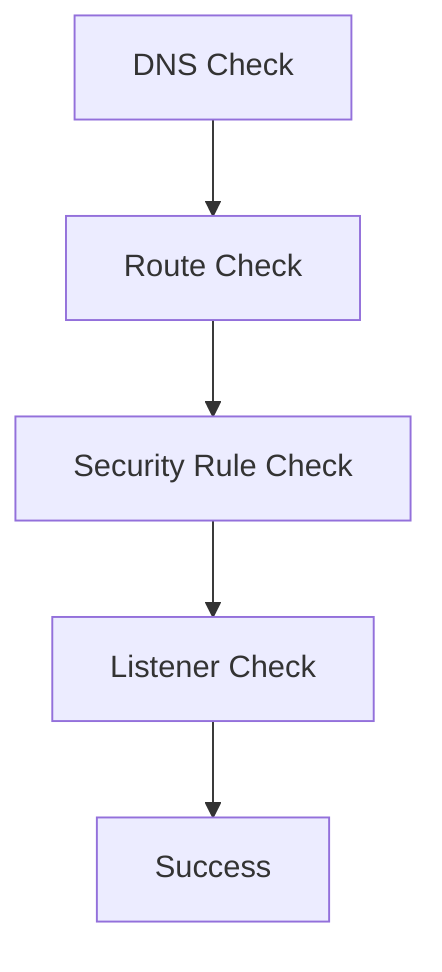

---
hide:
  - toc
content_sources:
  diagrams:
    - id: diagnostic-framework
      type: flowchart
      source: self-generated
      justification: "Synthesized quick-reference diagram for this guide from Microsoft Learn networking documentation."
      based_on:
        - https://learn.microsoft.com/en-us/azure/network-watcher/network-watcher-connectivity-overview
        - https://learn.microsoft.com/en-us/azure/network-watcher/connection-troubleshoot-overview
---

# Networking vs Connectivity

Understanding how to solve a connectivity problem is different from knowing how to configure a network.

## Concepts Comparison

| Layer | Control Plane | Data Path |
|-------|---------------|-----------|
| DNS | Zones / Records | Lookup (UDP 53) |
| Routing | Route Table / UDR | Packet Forwarding |
| Security | NSG / ASG Rules | Traffic Permit / Deny |
| Listener | VM / Pod Config | Listening (TCP / UDP) |

## Diagnostic Framework

<!-- diagram-id: diagnostic-framework -->

!!! note
    Always verify name resolution before checking routes. If the IP address you're targeting is wrong, the best routing in the world won't help.

## See Also

- [How Azure Networking Works](../platform/how-azure-networking-works.md)
- [Private Connectivity Options](../platform/private-connectivity-options.md)
- [Connectivity Decision Guide](../reference/connectivity-decision-guide.md)

## Sources
- [Azure Networking Diagnostics](https://learn.microsoft.com/en-us/azure/network-watcher/network-watcher-connectivity-overview)
- [Troubleshoot Virtual Network Connections](https://learn.microsoft.com/en-us/azure/network-watcher/connection-troubleshoot-overview)
