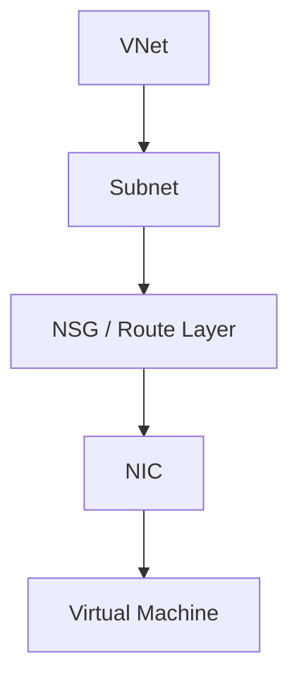

---
hide:
  - toc
content_sources:
  diagrams:
    - id: big-picture
      type: flowchart
      source: mslearn-adapted
      mslearn_url: https://learn.microsoft.com/en-us/azure/virtual-network/virtual-networks-overview
---

# Overview

Azure Networking is the foundation of almost every cloud solution. Most configuration errors manifest as connectivity issues.

## Key Networking Concepts

| Concept | Description | Core Function |
|---------|-------------|---------------|
| VNet | Virtual Network | The boundary for address space |
| Subnet | Segmentation | IP range within a VNet |
| NSG | Security | Traffic filtering rules (L4) |
| DNS | Resolution | Name to IP mapping |
| Routing | Traffic Path | Where packets go (Next Hop) |
| PE | Private Endpoint | Private IP for a SaaS service |

## Big Picture

<!-- diagram-id: big-picture -->

!!! note
    Azure networking is a shared responsibility. Microsoft maintains the physical network and hypervisor, while you manage VNet layout, routing, and security.

## Scope
- Included: VNet design, subnets, NSGs, Azure DNS, UDRs, Private Endpoints.
- Excluded: Application-layer protocols (HTTP/gRPC), third-party NVAs.

## See Also

- [How Azure Networking Works](../platform/how-azure-networking-works.md)
- [Common Scenarios](common-scenarios.md)
- [Azure Networking Components](../reference/azure-networking-components.md)

## Sources
- [Azure Virtual Network Overview](https://learn.microsoft.com/en-us/azure/virtual-network/virtual-networks-overview)
- [What is Azure Virtual Network?](https://learn.microsoft.com/en-us/azure/virtual-network/virtual-networks-overview)
