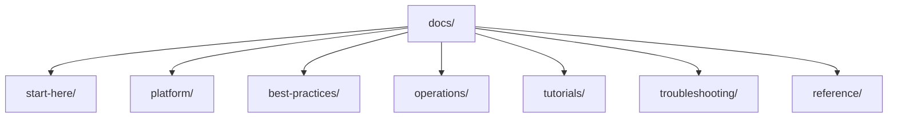

---
content_sources:
  diagrams:
    - id: repository-map
      type: flowchart
      source: self-generated
      justification: "Repository map diagram created for this guide, grounded in Microsoft Learn networking overview and Cloud Adoption Framework network topology content."
      based_on:
        - https://learn.microsoft.com/en-us/azure/virtual-network/
        - https://learn.microsoft.com/en-us/azure/virtual-network/virtual-networks-overview
        - https://learn.microsoft.com/en-us/azure/cloud-adoption-framework/ready/landing-zone/design-area/network-topology-and-connectivity
---

# Repository Map

The Azure Networking Practical Guide is organized to mirror the workflow of designing, operating, and troubleshooting Azure network connectivity. This page explains the structure and purpose of each section so you can jump directly to what you need.

<!-- diagram-id: repository-map -->

## Directory Structure

- `docs/start-here/`
    - `overview.md`: Big-picture introduction to Azure networking topology and this guide.
    - `learning-paths.md`: Role-based reading paths for network engineers, platform teams, and app owners.
    - `repository-map.md`: This file — a map of major sections and when to use them.
    - `networking-vs-connectivity.md`: How to frame networking problems as connectivity problems.
    - `common-scenarios.md`: Hub-spoke, hybrid, and SaaS integration patterns.
- `docs/platform/`
    - Core concepts: VNet, subnets, IP addressing, DNS, routing, network security, load balancing, private and hybrid connectivity.
- `docs/best-practices/`
    - Production patterns: network design baseline, subnet design, DNS, routing, NSG and firewall, private endpoints, observability, cost awareness, anti-patterns.
- `docs/operations/`
    - Day-2 execution: create VNets and subnets, configure NSG/DNS/UDR, connect private endpoints, peering, VPN and ExpressRoute basics, monitor network paths, packet capture.
- `docs/tutorials/`
    - Hands-on lab guides: hub-spoke topology, private endpoints, Application Gateway WAF, Azure Firewall, ExpressRoute simulation.
- `docs/troubleshooting/`
    - Diagnosis-first content: architecture overview, decision tree, evidence map, mental model, quick diagnosis cards, first-10-minutes runbooks, and playbooks for connectivity, DNS, and routing.
- `docs/reference/`
    - Quick-lookup material: connectivity decision guide, networking components, DNS and routing cheatsheets, private connectivity options, glossary, and content validation status.

## When to Use Each Section

| If you want to... | Go to |
|---|---|
| Understand Azure networking concepts | [Platform](../platform/index.md) |
| Design a production network | [Best Practices](../best-practices/index.md) |
| Configure networking in production | [Operations](../operations/index.md) |
| Practice with a hands-on lab | [Tutorials](../tutorials/index.md) |
| Diagnose a live incident | [Troubleshooting](../troubleshooting/index.md) |
| Look up a decision or command | [Reference](../reference/index.md) |

## See Also

- [Overview](overview.md)
- [Learning Paths](learning-paths.md)
- [Networking vs Connectivity](networking-vs-connectivity.md)
- [Common Scenarios](common-scenarios.md)

## Sources

- [Azure Virtual Network Documentation](https://learn.microsoft.com/en-us/azure/virtual-network/)
- [Azure Virtual Network Concepts](https://learn.microsoft.com/en-us/azure/virtual-network/virtual-networks-overview)
- [Cloud Adoption Framework — Network Topology and Connectivity](https://learn.microsoft.com/en-us/azure/cloud-adoption-framework/ready/landing-zone/design-area/network-topology-and-connectivity)
