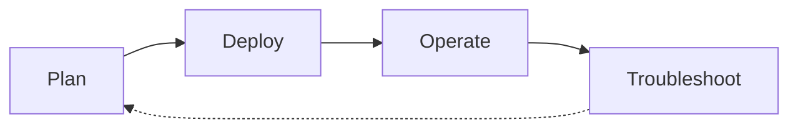

# Scenario Router

Use this page when you have a specific situation and want to jump straight to the page that answers it. This is a breadth-first index across four lifecycle phases — Plan, Deploy, Operate, Troubleshoot — that complements the depth-first [Learning Paths](learning-paths.md) and the symptom-first [Decision Tree](../troubleshooting/decision-tree.md).

!!! tip "Start with Learning Paths if you're new to Azure Networking"
    This page assumes you already know what you're trying to do. If you're still deciding what to learn first, start with [Learning Paths](learning-paths.md) — it sequences a role-based tour of the guide. Use this Scenario Router when you have a specific question and want to jump to the exact page that answers it.

## How to Use This Router

- Pick the table for the lifecycle phase you're in — Plan, Deploy, Operate, or Troubleshoot.
- Scan the left column for the situation that matches yours; open the destination on the right.
- If two rows fit, prefer the row from the phase you're actually in — the same platform concept often appears in more than one phase.
- If your situation spans two phases (a design choice today that will become an incident later), check [Cross-Phase Scenarios](#cross-phase-scenarios) first.
- Every destination is a real page in this guide, not an external link and not an aspirational page.
- Rows are intentionally short. Follow the link for the depth; this table is a switchboard, not a summary.
- If your situation is missing, [open an issue](https://github.com/yeongseon/azure-networking-practical-guide/issues) — the router is meant to grow.

## Lifecycle Overview

<!-- diagram-id: networking-scenario-router-lifecycle -->

## I'm Planning

| Situation | Where to go |
|---|---|
| I'm choosing which learning path to follow | [Learning Paths](learning-paths.md) — role-based reading paths |
| I want to understand how Azure networking works end-to-end | [How Azure Networking Works](../platform/how-azure-networking-works.md) — packet flow and control plane |
| I'm deciding whether this guide covers my connectivity problem | [Networking vs Connectivity](networking-vs-connectivity.md) — scope framing |
| I'm designing VNet address space and subnet layout | [VNet and Subnet Basics](../platform/vnet-and-subnet-basics.md) — CIDR, sizing, and reservation |
| I'm planning IP addressing across VNets and regions | [IP Addressing](../platform/ip-addressing.md) — public, private, and BYOIP options |
| I'm choosing between load balancer, App Gateway, and Front Door | [Load Balancing Options](../platform/load-balancing-options.md) — L4 vs L7, regional vs global |
| I'm evaluating Private Link, Private Endpoint, and Service Endpoints | [Private Connectivity Options](../platform/private-connectivity-options.md) — private-plane connectivity choices |
| I'm designing the network baseline for a new landing zone | [Network Design Baseline](../best-practices/network-design-baseline.md) — hub-spoke, segmentation, and identity |
| I want to plan network cost before I deploy | [Cost Awareness](../best-practices/cost-awareness-best-practices.md) — egress, gateways, and PE ingestion cost |

## I'm Deploying

| Situation | Where to go |
|---|---|
| I need to create the initial VNet and subnets | [Create VNet and Subnets](../operations/create-vnet-and-subnets.md) — CIDR carve-out and delegation |
| I need to attach NSGs to a subnet or NIC | [Configure NSG](../operations/configure-nsg.md) — rule ordering and effective rules |
| I need to set up private DNS for a VNet | [Configure DNS](../operations/configure-dns.md) — Private DNS Zone, linked zones, and forwarders |
| I need to install a UDR to force traffic through a firewall | [Configure UDR](../operations/configure-udr.md) — route table, next-hop, and BGP interaction |
| I need to attach a private endpoint to a PaaS service | [Connect Private Endpoints](../operations/connect-private-endpoints.md) — PE, NIC, and DNS wiring |
| I'm peering two VNets for hub-and-spoke topology | [Peering Basics](../operations/peering-basics.md) — peering flags, transitive limits, and gateway transit |

## I'm Operating in Production

| Situation | Where to go |
|---|---|
| I need day-2 network operational procedures | [Operations Hub](../operations/index.md) — configure, peer, monitor, and diagnose |
| I want to follow production network best practices | [Best Practices Hub](../best-practices/index.md) — hardening and design guidance |
| I'm wiring VPN or ExpressRoute to on-premises | [VPN and ExpressRoute Basics](../operations/vpn-and-expressroute-basics.md) — gateway SKUs and route exchange |
| I need to monitor network paths and reachability | [Monitor Network Paths](../operations/monitor-network-paths.md) — Connection Monitor and NSG flow logs |
| I need to capture packets to prove a hypothesis | [Packet Capture and Diagnostics](../operations/packet-capture-and-diagnostics.md) — Network Watcher capture flow |
| I'm hardening DNS resolution to avoid split-horizon pitfalls | [DNS Best Practices](../best-practices/dns-best-practices.md) — forwarders, split-horizon, and PE zones |
| I'm hardening NSG and Azure Firewall rules for production | [NSG and Firewall Best Practices](../best-practices/nsg-and-firewall-best-practices.md) — deny-first, logging, and rule review |
| I'm operating private endpoints at scale | [Private Endpoint Best Practices](../best-practices/private-endpoint-best-practices.md) — DNS, subnet, and lifecycle patterns |
| I'm building the network observability baseline | [Observability Best Practices](../best-practices/observability-best-practices.md) — flow logs, workbooks, and alerts |

## I'm Troubleshooting

| Situation | Where to go |
|---|---|
| I need to systematically diagnose a networking issue | [Decision Tree](../troubleshooting/decision-tree.md) — hypothesis-driven triage flow |
| I need to know what evidence to collect | [Evidence Map](../troubleshooting/evidence-map.md) — question → CLI + diagnostic artifact index |
| I want quick pattern-match cards for common symptoms | [Quick Diagnosis Cards](../troubleshooting/quick-diagnosis-cards.md) — one-page symptom cards |
| An incident just started and I have 10 minutes | [First 10 Minutes](../troubleshooting/first-10-minutes/index.md) — ordered triage checklist |
| I need the mental model for how packets get dropped | [Mental Model](../troubleshooting/mental-model.md) — reachability decomposition |
| DNS resolution is returning the wrong record or timing out | [DNS Resolution Failures](../troubleshooting/playbooks/dns/dns-resolution-failures.md) — split-horizon and forwarder issues |
| Traffic is being dropped at NSG, UDR, or Firewall | [Connectivity Failures](../troubleshooting/playbooks/connectivity-failures.md) — reachability from source to destination |
| I cannot reach a private endpoint from the VNet | [Cannot Reach Private Endpoint](../troubleshooting/playbooks/connectivity/cannot-reach-private-endpoint.md) — DNS, NIC, and NSG paths |
| I'm seeing intermittent latency spikes or packet loss | [Latency and Packet Loss](../troubleshooting/playbooks/connectivity/latency-and-packet-loss.md) — path, MTU, and queue depth |
| Load balancer health probes are failing | [Load Balancer Health Probe Failures](../troubleshooting/playbooks/load-balancer-health-probe-failures.md) — probe path, response, and NSG allow |

## Cross-Phase Scenarios

Some situations straddle two phases — the design choice you make while planning determines the failure mode you eventually debug. These rows link the two together so you can see the pattern *and* the drill in one place. If you're only in one phase today, still skim this table: it's the cheapest way to preview which decisions will hurt later.

| Situation | Where to go |
|---|---|
| I'm designing subnets and want to see how mis-sizing fails later | [Subnet Design Best Practices](../best-practices/subnet-design-best-practices.md) then [Connectivity Failures](../troubleshooting/playbooks/connectivity-failures.md) — sizing decision + failure mode |
| I'm setting up Private DNS and want to see how split-horizon fails | [DNS Best Practices](../best-practices/dns-best-practices.md) then [DNS Resolution Failures](../troubleshooting/playbooks/dns/dns-resolution-failures.md) — pattern + incident |
| I'm attaching private endpoints and want to see the DNS failure mode | [Private Endpoint Best Practices](../best-practices/private-endpoint-best-practices.md) then [Cannot Reach Private Endpoint](../troubleshooting/playbooks/connectivity/cannot-reach-private-endpoint.md) — design + drill |
| I'm wiring hybrid connectivity and want to see route-exchange failures | [Hybrid Connectivity Best Practices](../best-practices/hybrid-connectivity-best-practices.md) then [Hybrid Connectivity Issues](../troubleshooting/playbooks/routing/hybrid-connectivity-issues.md) — plan + operate |

## When This Router Isn't the Right Entry Point

- You're brand new to Azure networking → start with [Learning Paths](learning-paths.md) instead.
- You already have a symptom (DNS timeout, connection refused, high latency) and don't know which lifecycle phase you're in → jump to [Decision Tree](../troubleshooting/decision-tree.md) or [Quick Diagnosis Cards](../troubleshooting/quick-diagnosis-cards.md).
- You're evaluating Azure networking against other connectivity approaches → use [Networking vs Connectivity](networking-vs-connectivity.md).

## See Also

- [Learning Paths](learning-paths.md) — depth-first, role-based reading order
- [Overview](overview.md) — what Azure networking is and who this guide is for
- [Repository Map](repository-map.md) — full section map
- [Networking vs Connectivity](networking-vs-connectivity.md) — scope framing for the guide
- [Decision Tree](../troubleshooting/decision-tree.md) — symptom-first troubleshooting router
- [Evidence Map](../troubleshooting/evidence-map.md) — evidence-collection index
