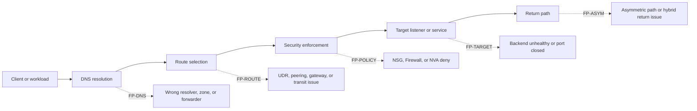
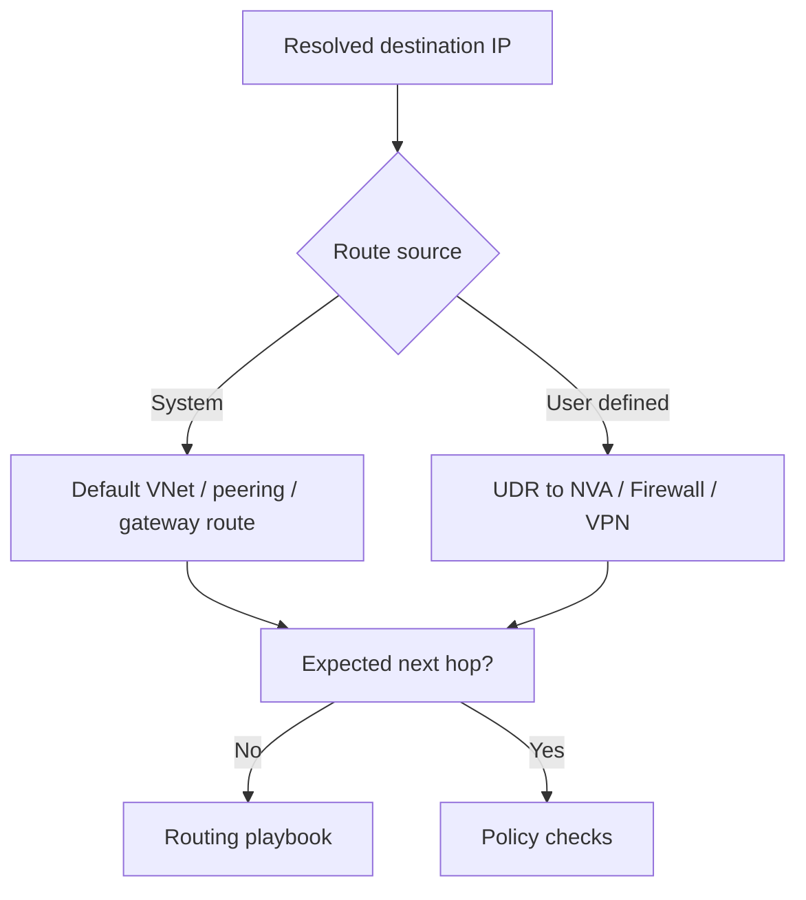
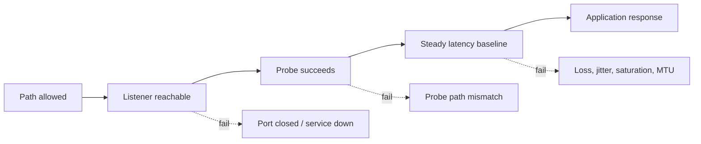

# Troubleshooting Architecture Overview

Use this page to answer one question quickly: **where in the Azure networking path can this break?**

## Network failure-plane overview

## 1) Resolution plane

DNS failures often look like generic connectivity failures because the packet never starts with the correct destination.

| Failure point | Typical symptom | Check first | Primary playbook |
| --- | --- | --- | --- |
| FP-DNS-01 Wrong resolver | Works from one host but not another | Client resolver settings, `resolv.conf`, NIC DNS | [DNS Resolution Failures](playbooks/dns/dns-resolution-failures.md) |
| FP-DNS-02 Missing Private DNS link | Private Endpoint resolves to public IP or NXDOMAIN | Private DNS zone virtual network links | [Cannot Reach Private Endpoint](playbooks/connectivity/cannot-reach-private-endpoint.md) |
| FP-DNS-03 Forwarder chain failure | Custom DNS cannot resolve Azure private names | Conditional forwarders, `168.63.129.16` path | [DNS Resolution Failures](playbooks/dns/dns-resolution-failures.md) |

## 2) Path selection plane

After resolution is correct, Azure must choose the intended path through system routes, user-defined routes, peering, or gateways.

| Failure point | Typical symptom | Check first | Primary playbook |
| --- | --- | --- | --- |
| FP-ROUTE-01 Wrong next hop | Traffic reaches NVA or internet unexpectedly | Effective routes / next hop | [NSG vs UDR vs Firewall](playbooks/routing/nsg-vs-udr-vs-firewall.md) |
| FP-ROUTE-02 Peering mismatch | Peered VNets cannot talk | Both sides of peering, address space, transit flags | [Peering and Routing Issues](playbooks/routing/peering-and-routing-issues.md) |
| FP-ROUTE-03 Hybrid route learning failure | On-prem prefixes disappear or flap | BGP state, advertised routes, Local Network Gateway | [Hybrid Connectivity Issues](playbooks/routing/hybrid-connectivity-issues.md) |

## 3) Policy enforcement plane

Security and service-chain controls decide whether the chosen path is allowed.

| Failure point | Typical symptom | Check first | Primary playbook |
| --- | --- | --- | --- |
| FP-POLICY-01 NSG deny | Flow silently drops at subnet/NIC | Effective security rules, IP Flow Verify | [NSG vs UDR vs Firewall](playbooks/routing/nsg-vs-udr-vs-firewall.md) |
| FP-POLICY-02 Firewall/NVA deny | Flow reaches inspection hop but not target | Firewall logs, rule collection / DNAT path | [Inbound Connectivity Issues](playbooks/connectivity/inbound-connectivity-issues.md) |
| FP-POLICY-03 Private Endpoint policy confusion | Private access configured but still blocked | PE subnet policy, DNS, NSG / Firewall alignment | [Cannot Reach Private Endpoint](playbooks/connectivity/cannot-reach-private-endpoint.md) |

## 4) Target and performance plane

Sometimes networking is healthy and the real failure sits at the target listener, backend probe, or a time-sensitive path issue.

| Failure point | Typical symptom | Check first | Primary playbook |
| --- | --- | --- | --- |
| FP-TARGET-01 Listener absent | TCP connection fails even with correct route | Target port listener, backend health | [Inbound Connectivity Issues](playbooks/connectivity/inbound-connectivity-issues.md) |
| FP-TARGET-02 Probe failure | Public frontend is down but backend exists | Load balancer / gateway probe state | [Inbound Connectivity Issues](playbooks/connectivity/inbound-connectivity-issues.md) |
| FP-PERF-01 Loss or latency | Slow or lossy path without hard deny | Connection Monitor, RTT, hop latency | [Latency and Packet Loss](playbooks/connectivity/latency-and-packet-loss.md) |
| FP-PERF-02 Time-window failure | Random drops or flapping path | Timeline correlation, packet capture, DNS TTL | [Intermittent Network Failures](playbooks/connectivity/intermittent-network-failures.md) |

## 5) Practical incident routing

1. Validate the DNS answer.
2. Validate the selected next hop.
3. Validate the effective allow/deny decision.
4. Validate target health and performance.

If any step fails, stop and open the linked playbook before expanding the scope.

!!! note "Architecture-first troubleshooting"
    Azure networking incidents are often multi-layered, but the first broken layer usually decides the fastest route to evidence. Use this page to identify that first broken layer, not to prove the final root cause by itself.

## See Also

- [Decision Tree](decision-tree.md)
- [Evidence Map](evidence-map.md)
- [Mental Model](mental-model.md)
- [Playbooks Index](playbooks/index.md)
- [Monitor Network Paths](../operations/monitor-network-paths.md)

## Sources

- [Azure Virtual Network traffic routing](https://learn.microsoft.com/en-us/azure/virtual-network/virtual-networks-udr-overview)
- [Network security groups overview](https://learn.microsoft.com/en-us/azure/virtual-network/network-security-groups-overview)
- [Azure Private Endpoint DNS configuration](https://learn.microsoft.com/en-us/azure/private-link/private-endpoint-dns)
- [Azure Network Watcher overview](https://learn.microsoft.com/en-us/azure/network-watcher/network-watcher-monitoring-overview)
