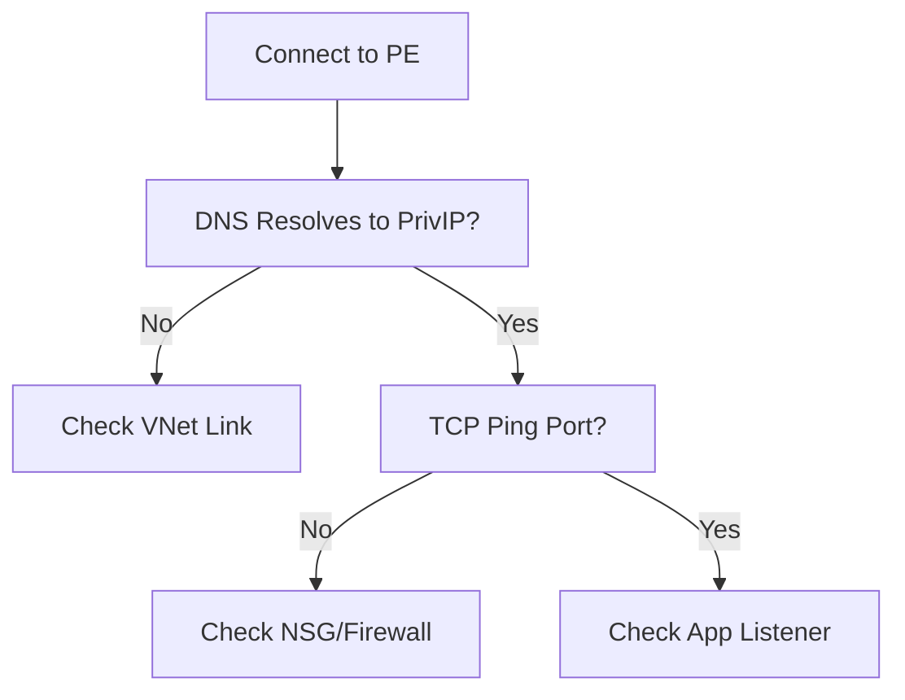

# Cannot Reach Private Endpoint

Diagnostics for Private Link connectivity failures.

| Check | Tool / Resource | Action |
| --- | --- | --- |
| DNS Resolution | nslookup / dig | Verify resolution to Private IP. |
| VNet Link | Private DNS Zone | Ensure VNet is linked to the zone. |
| NSG Rules | IP Flow Verify | Check if 443 (or other) is blocked. |
| Routes | Effective Routes | Ensure no UDR is overriding path. |

!!! warning
    Most Private Endpoint failures are actually DNS failures where the resource resolves to a Public IP.

## Sources

- [Troubleshoot Azure Private Endpoint connectivity](https://learn.microsoft.com/en-us/azure/private-link/troubleshoot-private-endpoint-connectivity)
- [Validate Private Endpoint DNS resolution](https://learn.microsoft.com/en-us/azure/private-link/private-endpoint-dns#validation)
