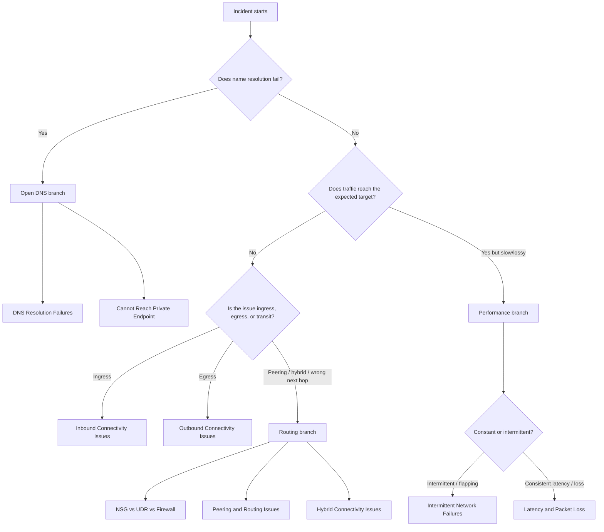
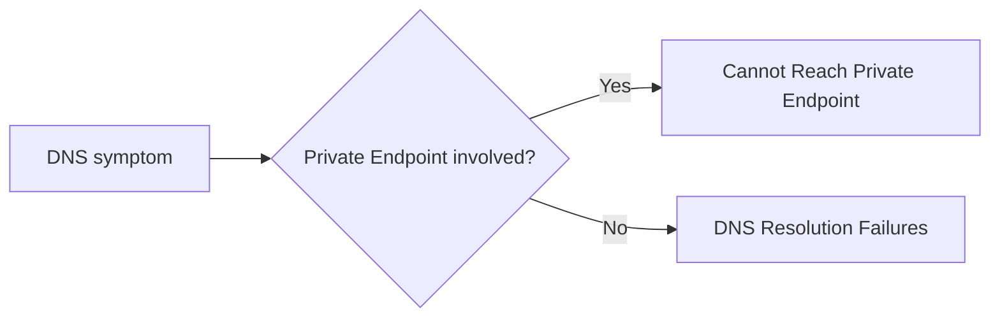
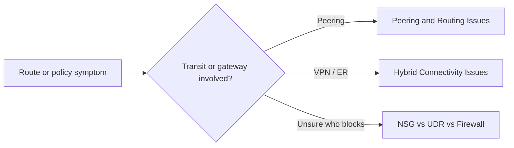

---
hide:
  - toc
---

# Troubleshooting Decision Tree

Use this page to route from observed symptom to the correct Azure Networking playbook in the first few minutes of an incident.

## Main triage tree



## Symptom-to-playbook map

| Symptom | Likely category | Playbook |
| --- | --- | --- |
| `NXDOMAIN`, wrong IP, DNS timeout | DNS | [DNS Resolution Failures](playbooks/dns/dns-resolution-failures.md) |
| Private Endpoint resolves publicly or fails privately | DNS + connectivity | [Cannot Reach Private Endpoint](playbooks/connectivity/cannot-reach-private-endpoint.md) |
| Public or private listener unreachable from client | Connectivity | [Inbound Connectivity Issues](playbooks/connectivity/inbound-connectivity-issues.md) |
| Workload cannot reach internet or external service | Connectivity | [Outbound Connectivity Issues](playbooks/connectivity/outbound-connectivity-issues.md) |
| Random drops, flapping, or time-window failures | Connectivity | [Intermittent Network Failures](playbooks/connectivity/intermittent-network-failures.md) |
| RTT high, sustained packet loss, poor throughput | Connectivity | [Latency and Packet Loss](playbooks/connectivity/latency-and-packet-loss.md) |
| Unsure whether route or policy is winning | Routing | [NSG vs UDR vs Firewall](playbooks/routing/nsg-vs-udr-vs-firewall.md) |
| Peered VNets cannot exchange traffic | Routing | [Peering and Routing Issues](playbooks/routing/peering-and-routing-issues.md) |
| VPN / ExpressRoute route or tunnel issue | Routing | [Hybrid Connectivity Issues](playbooks/routing/hybrid-connectivity-issues.md) |

## DNS branch



## Routing branch



## Minimal evidence before selecting a branch

- Resolver output for the exact FQDN.
- Effective routes or next-hop output for the source NIC/subnet.
- Effective security rules, firewall logs, or IP Flow Verify.
- Probe, listener, or Connection Monitor evidence if target health is in question.

```bash
az network watcher test-connectivity --source-resource <source-id> --dest-address <fqdn-or-ip> --dest-port 443
az network nic show-effective-route-table --resource-group <resource-group> --name <nic-name>
az network nic list-effective-nsg --resource-group <resource-group> --name <nic-name>
```

!!! warning "Do not skip reclassification"
    If the first branch does not match the evidence timeline, return to the top and reclassify. Many Azure networking incidents are initially described with the wrong symptom label.

## See Also

- [Architecture Overview](architecture-overview.md)
- [Evidence Map](evidence-map.md)
- [Quick Diagnosis Cards](quick-diagnosis-cards.md)
- [First 10 Minutes](first-10-minutes/index.md)
- [Playbooks Index](playbooks/index.md)

## Sources

- [Troubleshoot a connection in Azure Network Watcher](https://learn.microsoft.com/en-us/azure/network-watcher/connection-troubleshoot-overview)
- [Diagnose a virtual machine routing problem](https://learn.microsoft.com/en-us/azure/network-watcher/diagnose-vm-network-routing-problem)
