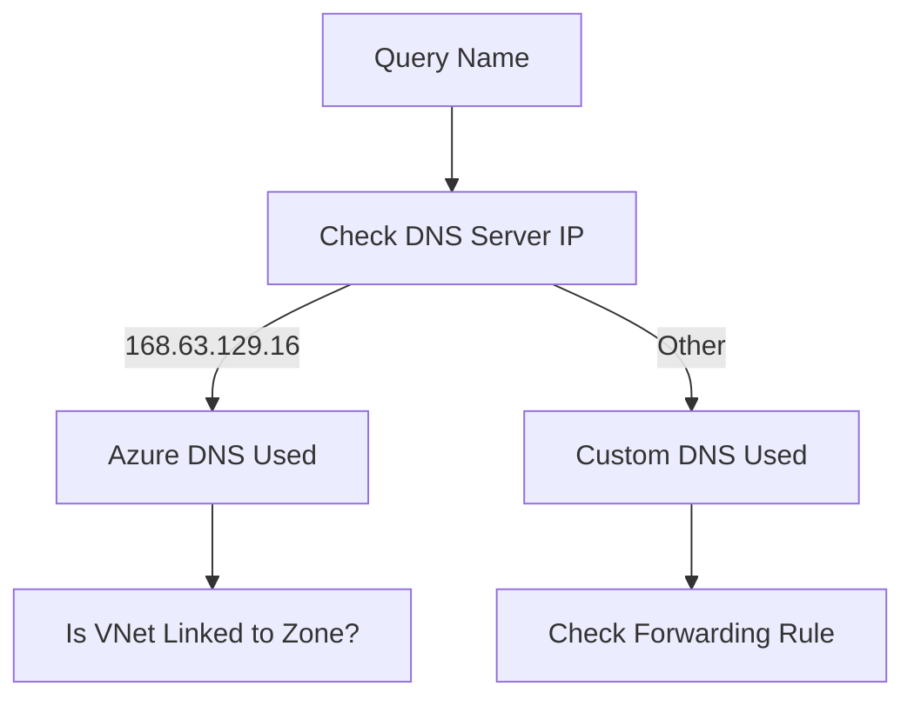

# DNS Resolution Failures

Addressing naming resolution issues in VNets.

| Symptom | Probable Cause | Resolution |
| --- | --- | --- |
| Resolves to Public IP | Missing Private Zone Link. | Add VNet Link to Zone. |
| NXDOMAIN | Record not in Zone. | Add/Verify Record. |
| Timeout | DNS Port 53 Blocked. | Check NSG / Firewall. |
| Incorrect IP | Overlapping DNS Zones. | Review Zone precedence. |

| Quick Check | Where to Inspect | Success Criteria |
| --- | --- | --- |
| Client DNS server | NIC or OS resolver settings | Expected DNS server is active. |
| Zone link | Private DNS zone virtual network links | Correct VNet appears linked. |
| Forwarders | Custom DNS conditional forwarding | Rule points to Azure resolver path. |

!!! note
    Check which DNS server the client is using with `ipconfig /all` or `cat /etc/resolv.conf`.

## See Also

- [DNS Basics](../platform/dns-basics.md)
- [Configure DNS](../operations/configure-dns.md)
- [DNS Resolution Cheatsheet](../reference/dns-resolution-cheatsheet.md)

## Sources

- [Azure DNS troubleshooting guide](https://learn.microsoft.com/en-us/azure/dns/dns-troubleshoot)
- [Azure Private DNS overview](https://learn.microsoft.com/en-us/azure/dns/private-dns-overview)
