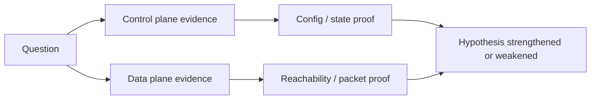

---
hide:
  - toc
---

# Evidence Map

This page maps common Azure Networking troubleshooting questions to the evidence source that answers them fastest.



## Quick evidence matrix

| Investigation question | Best first evidence | Tool / command | Playbook |
| --- | --- | --- | --- |
| Which DNS server is actually used? | Resolver settings on source | `ipconfig /all`, `cat /etc/resolv.conf`, NIC DNS settings | [DNS Resolution Failures](playbooks/dns/dns-resolution-failures.md) |
| Does the FQDN resolve to the expected private IP? | `nslookup` / `dig` result in source context | `nslookup <fqdn>` | [Cannot Reach Private Endpoint](playbooks/connectivity/cannot-reach-private-endpoint.md) |
| What next hop will Azure choose? | Effective routes / next hop | `az network watcher show-next-hop ...` | [NSG vs UDR vs Firewall](playbooks/routing/nsg-vs-udr-vs-firewall.md) |
| Is NSG blocking the flow? | IP Flow Verify / effective NSG | `az network watcher test-ip-flow ...` | [NSG vs UDR vs Firewall](playbooks/routing/nsg-vs-udr-vs-firewall.md) |
| Is a frontend failing because probes are unhealthy? | Load balancer or gateway backend health | Portal backend health / probe metrics | [Inbound Connectivity Issues](playbooks/connectivity/inbound-connectivity-issues.md) |
| Is outbound blocked, misrouted, or missing SNAT path? | IP-only vs FQDN egress test | `Test-NetConnection`, `curl`, next hop | [Outbound Connectivity Issues](playbooks/connectivity/outbound-connectivity-issues.md) |
| Are peering routes missing? | Effective route table on NIC | `az network nic show-effective-route-table ...` | [Peering and Routing Issues](playbooks/routing/peering-and-routing-issues.md) |
| Is BGP or tunnel health broken? | Connection state / learned routes | VPN / ER connection state, route tables | [Hybrid Connectivity Issues](playbooks/routing/hybrid-connectivity-issues.md) |
| Are failures random over time? | Timeline correlation | Azure Monitor metrics, packet capture, DNS TTL checks | [Intermittent Network Failures](playbooks/connectivity/intermittent-network-failures.md) |
| Is it real network latency or app latency? | RTT + hop latency + app response | Connection Monitor + traceroute + app telemetry | [Latency and Packet Loss](playbooks/connectivity/latency-and-packet-loss.md) |

## Evidence by layer

### Resolution layer

| Evidence | Good signal | Bad signal |
| --- | --- | --- |
| `nslookup`, `dig`, `Resolve-DnsName` | Expected record and IP family returned | NXDOMAIN, SERVFAIL, public IP for private target |
| Private DNS zone links | Correct VNet linked | Missing or stale link |
| Custom forwarder chain | Private zones forwarded correctly | Forwarder cannot resolve Azure private suffix |

### Path layer

| Evidence | Good signal | Bad signal |
| --- | --- | --- |
| Effective routes | Expected next hop present and active | Route points to wrong subnet, NVA, or internet |
| Connection troubleshoot / next hop | Expected path confirmed | Unexpected transit device or unreachable hop |
| Peering / gateway state | Connected and aligned on both sides | Disconnected, wrong flags, missing transit |

### Policy layer

| Evidence | Good signal | Bad signal |
| --- | --- | --- |
| Effective NSG rules | Matching allow rule for source/destination/port | Matching deny before allow |
| Firewall / NVA logs | Expected rule hit and allow | Deny or no matching DNAT/network rule |
| Private Endpoint state | Approved and reachable over private IP | Pending, rejected, or stale endpoint mapping |

### Performance layer

| Evidence | Good signal | Bad signal |
| --- | --- | --- |
| Connection Monitor / RTT baseline | Near expected baseline | Sustained increase or jitter burst |
| Traceroute | Stable hop profile | Delay spike at one hop or black hole |
| Packet capture / monitor timeline | Clean handshake and retransmit profile | Repeated retransmits, resets, or drops |

## Minimal command bundle

```bash
az network watcher test-connectivity --source-resource <source-id> --dest-address <fqdn-or-ip> --dest-port 443
az network watcher show-next-hop --resource-group <resource-group> --vm <vm-name> --source-ip <source-ip> --dest-ip <dest-ip>
az network watcher test-ip-flow --resource-group <resource-group> --vm <vm-name> --direction Outbound --protocol TCP --local <source-ip>:0 --remote <dest-ip>:443
az network nic show-effective-route-table --resource-group <resource-group> --name <nic-name>
az network nic list-effective-nsg --resource-group <resource-group> --name <nic-name>
```

!!! tip "Prefer proof over assumptions"
    In Azure networking, control-plane configuration and data-plane behavior can diverge temporarily. Always pair configuration evidence with an actual reachability or resolution test.

## See Also

- [Architecture Overview](architecture-overview.md)
- [Decision Tree](decision-tree.md)
- [Mental Model](mental-model.md)
- [First 10 Minutes](first-10-minutes/index.md)
- [Packet Capture and Diagnostics](../operations/packet-capture-and-diagnostics.md)

## Sources

- [Azure Network Watcher overview](https://learn.microsoft.com/en-us/azure/network-watcher/network-watcher-monitoring-overview)
- [Diagnose outbound connections using Azure Network Watcher](https://learn.microsoft.com/en-us/azure/network-watcher/network-watcher-connectivity-overview)
- [IP flow verify overview](https://learn.microsoft.com/en-us/azure/network-watcher/ip-flow-verify-overview)
