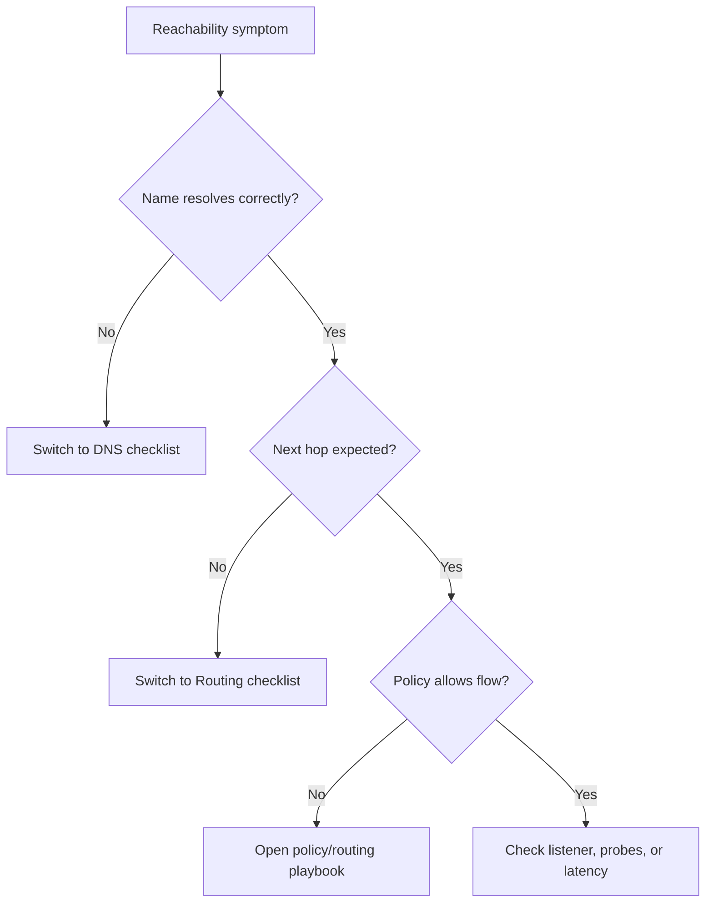

---
hide:
  - toc
content_sources:
  diagrams:
    - id: quick-context
      type: flowchart
      source: self-generated
      justification: "Synthesized troubleshooting flow for this guide from Microsoft Learn diagnostic and service documentation."
      based_on:
        - https://learn.microsoft.com/en-us/azure/network-watcher/connection-troubleshoot-overview
        - https://learn.microsoft.com/en-us/azure/network-watcher/diagnose-vm-network-routing-problem
---

# First 10 Minutes: Connectivity

## Quick Context
Use this checklist when the symptom is reachability, packet loss, intermittent failure, or latency. The first goal is to separate DNS, path, policy, and target health.

<!-- diagram-id: quick-context -->


## Step 1: Prove whether this is name-based or IP-based
- Run an IP-only test and a name-based test.
- Good signal: both fail the same way, meaning DNS is less likely.
- Bad signal: IP works but FQDN fails, meaning DNS is likely primary.

## Step 2: Check the expected path
- Use effective routes or next-hop diagnostics.
- Good signal: traffic takes the intended peering, gateway, or internet path.
- Bad signal: traffic exits to an unexpected NVA, gateway, or public path.

## Step 3: Check allow/deny outcome
- Use effective NSG, IP Flow Verify, and firewall/NVA logs.
- Good signal: an allow path clearly matches source, destination, and port.
- Bad signal: implicit or explicit deny matches first.

## Step 4: Confirm listener or probe health
- For inbound issues, validate frontend IP, backend health, and probe status.
- For outbound issues, validate dependency listener and port reachability.
- Good signal: TCP handshake reaches the correct listener.
- Bad signal: probe unhealthy, port closed, or connection reset/refused.

## Step 5: If the issue is time-based, switch to timeline mode
- Compare failures against load, route changes, DNS TTL expiry, or tunnel events.
- Good signal: stable baseline with no time-based spikes.
- Bad signal: repeated burst windows or periodic flapping.

## Decision points
- **Inbound path issue** -> [Inbound Connectivity Issues](../playbooks/connectivity/inbound-connectivity-issues.md)
- **Outbound path issue** -> [Outbound Connectivity Issues](../playbooks/connectivity/outbound-connectivity-issues.md)
- **Private Endpoint issue** -> [Cannot Reach Private Endpoint](../playbooks/connectivity/cannot-reach-private-endpoint.md)
- **Intermittent issue** -> [Intermittent Network Failures](../playbooks/connectivity/intermittent-network-failures.md)
- **Latency or loss** -> [Latency and Packet Loss](../playbooks/connectivity/latency-and-packet-loss.md)

```bash
az network watcher test-connectivity --source-resource <source-id> --dest-address <fqdn-or-ip> --dest-port 443
az network nic show-effective-route-table --resource-group <resource-group> --name <nic-name>
az network nic list-effective-nsg --resource-group <resource-group> --name <nic-name>
```

## See Also

- [DNS Checklist](dns.md)
- [Routing Checklist](routing.md)
- [Evidence Map](../evidence-map.md)
- [Playbooks Index](../playbooks/index.md)

## Sources

- [Connection troubleshoot in Azure Network Watcher](https://learn.microsoft.com/en-us/azure/network-watcher/connection-troubleshoot-overview)
- [Diagnose VM network routing problems](https://learn.microsoft.com/en-us/azure/network-watcher/diagnose-vm-network-routing-problem)
