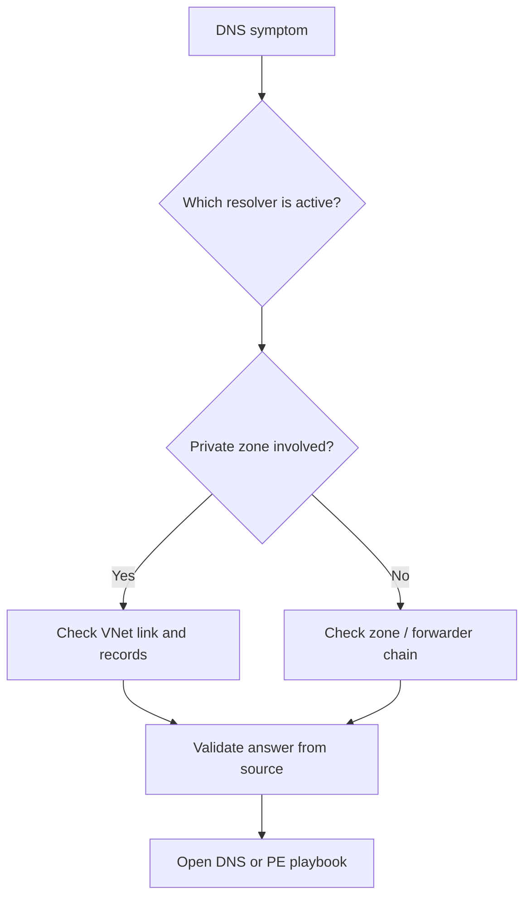

# First 10 Minutes: DNS

## Quick Context
Use this checklist when the failing signal is wrong name resolution: NXDOMAIN, timeout, public IP for a private target, or inconsistent answers across sources.



## Step 1: Identify the actual resolver in use
- Check OS or NIC resolver settings before trusting any query result.
- Good signal: expected Azure or custom DNS server is active.
- Bad signal: host uses unexpected resolver or stale custom DNS path.

## Step 2: Query from the failing source context
- Run `nslookup`, `dig`, or `Resolve-DnsName` from the actual source.
- Good signal: expected A or CNAME chain resolves consistently.
- Bad signal: NXDOMAIN, SERVFAIL, timeout, or wrong address.

## Step 3: If Private Endpoint is involved, inspect private DNS linkage
- Check private DNS zone links and A records.
- Good signal: correct VNet is linked and the private IP matches the endpoint.
- Bad signal: no link, stale record, or public IP answer.

## Step 4: If custom DNS is involved, validate forwarders
- Check whether Azure private suffixes are forwarded to the correct resolver path.
- Good signal: custom DNS can resolve both public and private names correctly.
- Bad signal: custom resolver fails only on Azure private names.

## Step 5: Separate DNS from connectivity
- If DNS is correct, test TCP reachability to the resolved IP.
- If DNS is wrong, stop path analysis and fix DNS first.

## Decision points
- **General DNS path issue** -> [DNS Resolution Failures](../playbooks/dns/dns-resolution-failures.md)
- **Private Endpoint-specific DNS or link issue** -> [Cannot Reach Private Endpoint](../playbooks/connectivity/cannot-reach-private-endpoint.md)

```bash
nslookup <fqdn>
dig <fqdn>
az network private-dns link vnet list --resource-group <resource-group> --zone-name <private-zone-name>
```

## See Also

- [Connectivity Checklist](connectivity.md)
- [Evidence Map](../evidence-map.md)
- [DNS Resolution Cheatsheet](../../reference/dns-resolution-cheatsheet.md)
- [DNS Playbooks](../playbooks/index.md#dns)

## Sources

- [Azure DNS troubleshooting](https://learn.microsoft.com/en-us/azure/dns/dns-troubleshoot)
- [Azure Private DNS overview](https://learn.microsoft.com/en-us/azure/dns/private-dns-overview)
