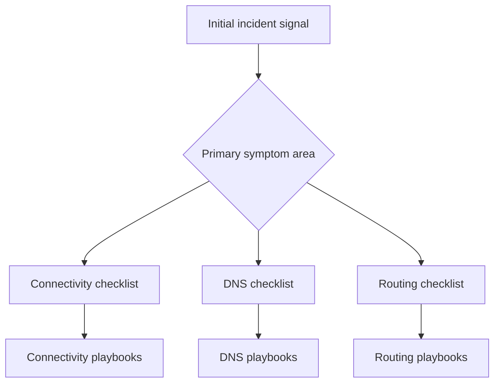

---
hide:
  - toc
content_sources:
  diagrams:
    - id: index
      type: flowchart
      source: self-generated
      justification: "Synthesized troubleshooting flow for this guide from Microsoft Learn diagnostic and service documentation."
      based_on:
        - https://learn.microsoft.com/en-us/azure/network-watcher/network-watcher-monitoring-overview
---

# Checklists

Fast triage guides for the first 10 minutes of an Azure Networking incident.

<!-- diagram-id: index -->

| Checklist | When to use |
| --- | --- |
| [Connectivity](connectivity.md) | Inbound, outbound, intermittent, latency, or Private Endpoint reachability |
| [DNS](dns.md) | Wrong IP, NXDOMAIN, timeout, split-horizon, private zone issues |
| [Routing](routing.md) | UDR, peering, gateway transit, BGP, or policy-order confusion |

## See Also

- [Troubleshooting Home](../index.md)
- [Decision Tree](../decision-tree.md)
- [Playbooks Index](../playbooks/index.md)

## Sources

- [Azure Network Watcher overview](https://learn.microsoft.com/en-us/azure/network-watcher/network-watcher-monitoring-overview)
